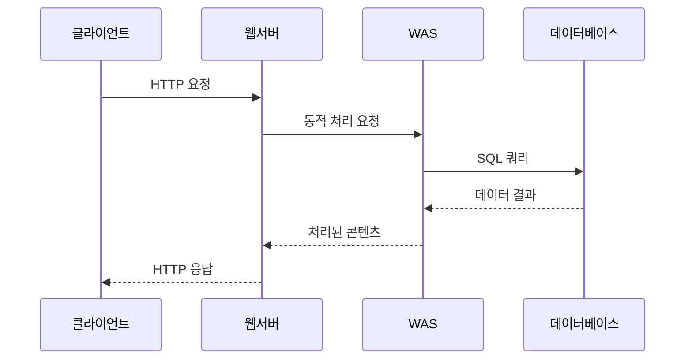
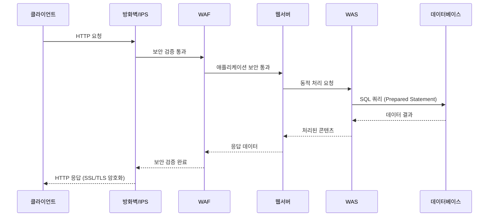

# 웹 서비스 구조와 운영체제 기술

---

## 3-Tier 아키텍처

### 구조
```
Client ↔ Web Server ↔ WAS ↔ Database
```

### 각 계층별 역할
| 계층 | 역할 | 구성 요소 |
|------|------|-----------|
| **Web Client** | UI 제공, 사용자 입력 처리 | 브라우저, 모바일 앱 |
| **Web Server** | 정적 콘텐츠 처리, 라우팅 | Apache, Nginx |
| **WAS** | 비즈니스 로직, 동적 콘텐츠 생성 | Tomcat, JBoss |
| **Database** | 영구 데이터 저장 | MySQL, Oracle |

### 시퀀스 다이어그램


### DB 연결 방식
- **JDBC** (Java Database Connectivity)
- **ODBC** (Open Database Connectivity)

---

## 웹 서비스 진화 과정

### 1단계: 정적 웹
- **구성**: HTML + CSS + 이미지
- **특징**: 서버에서 미리 작성된 파일만 전송
- **한계**: 사용자 상호작용 불가

### 2단계: 동적 웹 + JavaScript
- **추가**: JavaScript (서버 저장, 클라이언트 실행)
- **처리**: HTML/CSS 분석 → 이미지 렌더링 → JS 실행
- **장점**: 페이지 동적 움직임

### 3단계: 상태 관리 도입
**문제**: HTTP Stateless 특성으로 상태 관리 필요

**해결책**:
- **클라이언트**: 쿠키, 로컬 스토리지
- **서버**: 세션, 데이터베이스

### 4단계: API 기반 (현재)
**변화**: HTML 문서 → JSON/XML 데이터만 응답
**장점**:
- View 의존성 제거
- 역할 분리 (클라이언트: UI, WAS: API)

---

## 보안 아키텍처

### 보안 계층
```
Client ↔ [방화벽/IPS] ↔ [SSL] ↔ [WAF] ↔ Web Server ↔ WAS ↔ DB
```

### 시퀀스 다이어그램 (보안 포함)


### 주요 보안 위협
| 공격 유형 | 설명 | 대응 방법 |
|-----------|------|-----------|
| **SQL 인젝션** | 사용자 입력에 SQL 구문 삽입 | WAF 차단, Prepared Statement |
| **XSS** | 입력에 JavaScript 코드 삽입 | 입력값 검증, CSP 적용 |

### 보안 솔루션
- **WAF**: 웹 애플리케이션 계층 공격 차단
- **IPS**: 침입 차단 시스템
- **SSL/TLS**: 데이터 암호화

---

## 모니터링

### APM (Application Performance Monitoring)
**목적**: 애플리케이션 성능 및 장애 모니터링

### 주요 도구
- **제니퍼**: 국산 APM 솔루션
- **스카우터**: 오픈소스 APM
- **X-Log**: 성능 로그 분석

### 모니터링 대상
- DB 응답 시간
- JVM 상태 (메모리, GC)
- 트랜잭션 성능
- 에러율 및 처리량

---

## 운영체제 구조

### 하드웨어와 소프트웨어

#### 하드웨어 (연산 머신)
| 구성 요소 | 역할 |
|-----------|------|
| **CPU** | 연산 처리 |
| **RAM** | 메모리 저장 |
| **SSD** | 영구 저장장치 |

#### 소프트웨어 구조
```
┌─────────────────────────────────────┐
│          User Mode                  │
│  ┌─────────┐ ┌─────────┐ ┌─────────┐│
│  │Process 1│ │Process 2│ │   JVM   ││ ← Multitasking 환경
│  └─────────┘ └─────────┘ └─────────┘│
├─────────────────────────────────────┤
│          Kernel Mode                │
│              OS                     │
└─────────────────────────────────────┘
```

### 코드 분류

#### Native Code vs Managed Code
| 구분 | 설명 | 특징 | 예시 |
|------|------|------|------|
| **Native Code** | 커널 + CPU 의존적 코드 | 플랫폼 종속적 | C, C++, Assembly |
| **Managed Code** | 플랫폼 독립적 코드 | 가상머신 실행 | Java, C# |

#### 플랫폼
- **정의**: 운영체제 + 하드웨어 조합
- **예시**: Windows + x86, Linux + ARM

### JVM (Java Virtual Machine)

#### JVM의 역할
- **개념**: User Mode에서 실행되는 가상 플랫폼
- **구성**: OS + Memory + CPU 개념을 추상화
- **특징**: Java 코드를 플랫폼 독립적으로 실행

```
Java Code → JVM → OS → Hardware
```

### 비동기 입출력 vs 멀티스레딩

#### 비동기 입출력 (Async I/O)
- **개념**: 시간이 걸리는 작업을 OS(커널)에게 위임
- **과정**:
  1. User Mode 프로세스가 I/O 작업 요청
  2. 커널이 작업 처리
  3. 프로세스는 다른 작업 계속 진행
  4. 작업 완료 시 콜백 실행

#### 주요 I/O 작업
| 작업 유형 | 설명 |
|-----------|------|
| **File I/O** | 파일 읽기/쓰기 (read, write) |
| **Socket I/O** | 네트워크 통신 (send, receive) |

#### 비동기 vs 멀티스레딩
- **비동기**: 하나의 스레드에서 I/O 대기 없이 다른 작업 처리
- **멀티스레딩**: 여러 스레드로 동시 작업 처리
- **차이점**: 리소스 사용량, 컨텍스트 스위칭 오버헤드

---

## 브라우저에 URL 입력하면 벌어지는 일

### 전체 과정 개요
```
URL 입력 → DNS 조회 → TCP 연결 → HTTP 요청 → 서버 처리 → 응답 → 렌더링 → 캐싱
```

### 단계별 상세 과정

#### 1. URL 분석
**입력**: `https://www.abc.com/`
- **www**: 호스트 이름 (서브도메인)
- **abc.com**: 도메인 이름
- **https**: 프로토콜 (SSL/TLS 사용)

#### 2. IP 주소 확인 과정

| 순서 | 단계 | 설명 |
|------|------|------|
| 1 | **hosts 파일 확인** | 로컬 머신의 URL-IP 매핑 파일 검사 |
| 2 | **DNS 캐시 확인** | 브라우저/OS의 DNS 캐시 조회 |
| 3 | **DNS 쿼리** | ISP DNS 서버에 질의 |

#### 3. DNS (Domain Name System)

**DNS 서버 계층 구조**
```
Root DNS (.)
    ↓
TLD DNS (.com, .org, .kr)
    ↓
Authoritative DNS (abc.com)
    ↓
IP 주소 반환
```

**주요 개념**
- **ISP**: Internet Service Provider (KT, SKT, LG 등)
- **DNS**: 도메인 이름을 IP 주소로 변환하는 시스템
- **Root DNS**: 최상위 DNS 서버 (전 세계 13개)

#### 4. 네트워크 연결
1. **TCP 3-way handshake**: IP 주소로 서버와 연결
2. **HTTPS GET 요청**: 웹 페이지 요청
3. **HTTP 응답**: HTML, CSS, JS 등 리소스 수신

#### 5. 서버 처리 과정
```
웹서버 → WAS → DB → WAS → 웹서버
```
- 정적/동적 콘텐츠 처리
- 비즈니스 로직 실행
- 데이터베이스 조회

#### 6. 브라우저 렌더링
**순서**:
1. HTML 파싱
2. CSS 스타일 적용
3. 이미지 로딩
4. JavaScript 실행

#### 7. 캐싱
- **웹 캐시**: 정적 리소스 저장
- **디스크 캐시**: 로컬 저장소에 임시 보관
- **목적**: 재요청 시 빠른 응답

### 핵심 키워드
- **DNS 계층**: Root → TLD → Authoritative
- **ISP**: 인터넷 서비스 제공자 (통신사)
- **캐싱**: 성능 향상을 위한 임시 저장