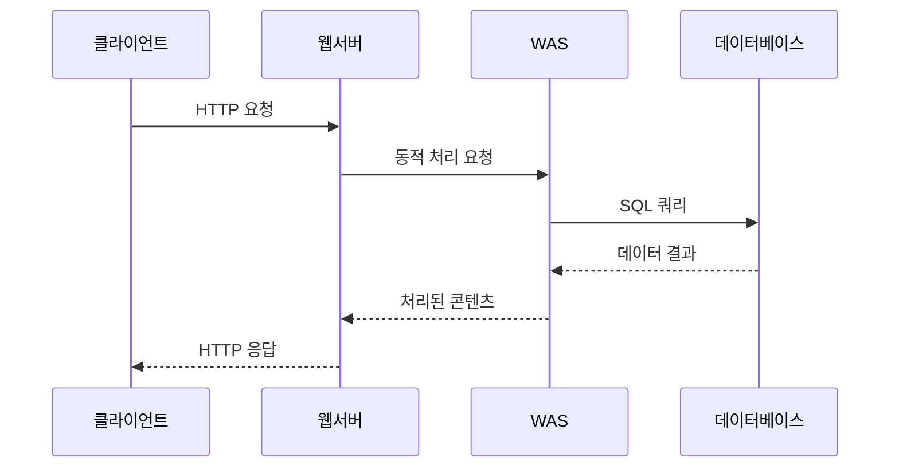
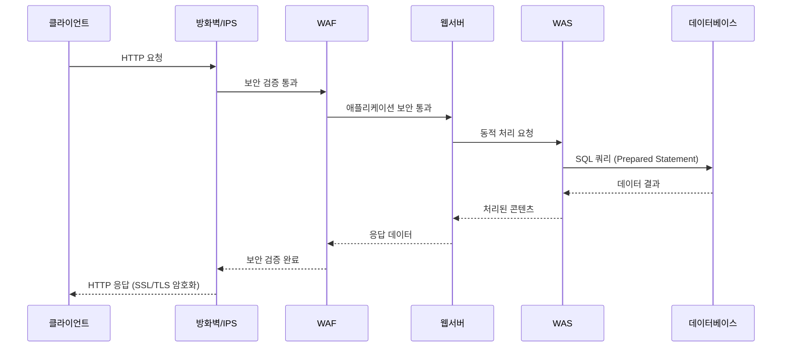

# 웹 서비스 구조와 운영체제 기술 (면접 대비)

## 📋 목차
1. [3-Tier 아키텍처](#3-tier-아키텍처)
2. [웹 서비스 진화 과정](#웹-서비스-진화-과정)
3. [보안 아키텍처](#보안-아키텍처)
4. [모니터링](#모니터링)

---

## 3-Tier 아키텍처

### 구조
```
Client ↔ Web Server ↔ WAS ↔ Database
```

### 각 계층별 역할
| 계층 | 역할 | 구성 요소 |
|------|------|-----------|
| **Web Client** | UI 제공, 사용자 입력 처리 | 브라우저, 모바일 앱 |
| **Web Server** | 정적 콘텐츠 처리, 라우팅 | Apache, Nginx |
| **WAS** | 비즈니스 로직, 동적 콘텐츠 생성 | Tomcat, JBoss |
| **Database** | 영구 데이터 저장 | MySQL, Oracle |

### 시퀀스 다이어그램


### DB 연결 방식
- **JDBC** (Java Database Connectivity)
- **ODBC** (Open Database Connectivity)

---

## 웹 서비스 진화 과정

### 1단계: 정적 웹
- **구성**: HTML + CSS + 이미지
- **특징**: 서버에서 미리 작성된 파일만 전송
- **한계**: 사용자 상호작용 불가

### 2단계: 동적 웹 + JavaScript
- **추가**: JavaScript (서버 저장, 클라이언트 실행)
- **처리**: HTML/CSS 분석 → 이미지 렌더링 → JS 실행
- **장점**: 페이지 동적 움직임

### 3단계: 상태 관리 도입
**문제**: HTTP Stateless 특성으로 상태 관리 필요

**해결책**:
- **클라이언트**: 쿠키, 로컬 스토리지
- **서버**: 세션, 데이터베이스

### 4단계: API 기반 (현재)
**변화**: HTML 문서 → JSON/XML 데이터만 응답
**장점**:
- View 의존성 제거
- 역할 분리 (클라이언트: UI, WAS: API)

---

## 보안 아키텍처

### 보안 계층
```
Client ↔ [방화벽/IPS] ↔ [SSL] ↔ [WAF] ↔ Web Server ↔ WAS ↔ DB
```

### 시퀀스 다이어그램 (보안 포함)


### 주요 보안 위협
| 공격 유형 | 설명 | 대응 방법 |
|-----------|------|-----------|
| **SQL 인젝션** | 사용자 입력에 SQL 구문 삽입 | WAF 차단, Prepared Statement |
| **XSS** | 입력에 JavaScript 코드 삽입 | 입력값 검증, CSP 적용 |

### 보안 솔루션
- **WAF**: 웹 애플리케이션 계층 공격 차단
- **IPS**: 침입 차단 시스템
- **SSL/TLS**: 데이터 암호화

---

## 모니터링

### APM (Application Performance Monitoring)
**목적**: 애플리케이션 성능 및 장애 모니터링

### 주요 도구
- **제니퍼**: 국산 APM 솔루션
- **스카우터**: 오픈소스 APM
- **X-Log**: 성능 로그 분석

### 모니터링 대상
- DB 응답 시간
- JVM 상태 (메모리, GC)
- 트랜잭션 성능
- 에러율 및 처리량

---

## 💡 핵심 키워드
- **3-Tier**: Client, Web Server, WAS, DB
- **Stateless**: HTTP 특성, 상태 관리 필요성
- **RESTful API**: CRUD, JSON/XML
- **보안**: SQL 인젝션, XSS, WAF
- **APM**: 성능 모니터링, 장애 대응