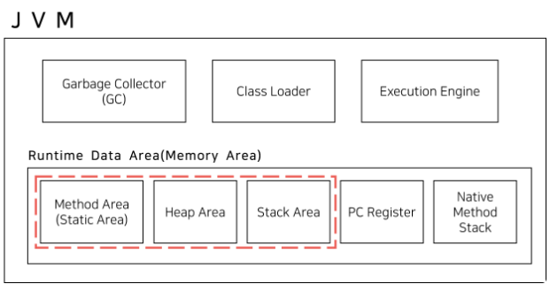

### JVM < JRE < JDK

| 구분     | JVM (Java Virtual Machine)                                                                      | JRE (Java Runtime Environment)                                                            | JDK (Java Development Kit)                                                                             |
| -------- | ----------------------------------------------------------------------------------------------- | ----------------------------------------------------------------------------------------- | ------------------------------------------------------------------------------------------------------ |
| **정의** | 자바 가상 머신으로, 자바 컴파일러에 의해 생성된 클래스 파일을 기계어로 변환해 주는 역할을 수행. | 자바 실행 환경으로, 자바로 만들어진 프로그램을 실행시키기 위한 라이브러리들과 JVM을 포함. | 자바 개발 키트로, 자바 개발에 필요한 도구와 라이브러리를 포함. JRE도 포함하여 자바 프로그램 실행 가능. |
| **구성** | - 클래스 로더 - 실행 엔진 - 가비지 콜렉터 - 런타임 데이터 영역                         | - 실행에 필요한 라이브러리들 - JVM - 사용자 인터페이스 도구 등                      | - JRE - 개발에 필요한 도구(javac, java debugger 등) - 라이브러리                                 |
| **용도** | - 바이트 코드(`.class`)를 기계어로 변환하여 실행 - OS 독립적 실행 환경 제공                  | - 자바 애플리케이션 실행 환경 제공                                                        | - 자바 애플리케이션 개발 및 실행                                                                       |

---

### JVM 메모리 구조

    

| 구분                            | 설명                                                                                                                                                                                                                                                               |
| ------------------------------- | ------------------------------------------------------------------------------------------------------------------------------------------------------------------------------------------------------------------------------------------------------------------ |
| **클래스 로더**                 | JVM 내로 클래스를 로드하는 시스템. 자바 바이트코드(.class 파일)를 JVM으로 로딩하고, 링크를 통해 배치하는 과정을 담당.                                                                                                                                              |
| **실행 엔진**                   | 바이트 코드를 실제로 실행할 수 있는 기계어로 변환하는 역할을 수행. 인터프리터와 JIT(`Just-In-Time`) 컴파일러를 포함하여, 바이트 코드를 효율적으로 실행.                                                                                                            |
| **가비지 컬렉터**               | 더 이상 사용되지 않는 메모리 자원을 자동으로 회수. Heap 영역에서 사용하지 않는 객체를 탐지하고, 메모리를 해제하여 메모리 누수를 방지.                                                                                                                              |
| **런타임 데이터 영역**          | JVM이 프로그램 실행을 위해 사용하는 메모리 공간. 다음 영역으로 구성됨:                                                                                                                                                                                             |
| - **Method Area (Static Area)** | - 클래스 수준의 정보(클래스 이름, 부모 클래스 이름, 메소드, 변수 등) 저장. - `static`과 `final` 변수도 이 영역에 저장됨. - JVM 내에 하나만 존재하며 모든 스레드가 공유.                                                                                      |
| - **Heap Area**                 | - 모든 클래스 인스턴스와 배열이 동적으로 할당되는 공간. - 가비지 컬렉션이 이루어지는 주 영역으로, 더 이상 참조되지 않는 객체를 자동으로 제거. - JVM 내에 하나만 존재하며 모든 스레드가 공유.                                                                 |
| - **Stack Area**                | - Java 메소드 호출 시 생성되는 지역변수, 파라미터, 리턴 값 등을 저장하는 영역. - 메소드가 호출될 때마다 각 스레드 별로 스택 프레임이 생성. - 동적 객체는 여기서 참조만 관리되며, 실제 객체는 Heap 영역에 저장됨. - 각 스레드가 자신만의 스택 영역을 가짐. |

---

### Java 컴파일 과정

#### 컴파일 타임

- 1. 소스 코드 작성 : .java로 소스 코드가 생성된다
- 2. 컴파일: 자바 컴파일러(`javac`)는 소스 코드(.java) 파일을 입력으로 받아 바이트 코드(.class)로 변환.

#### 런 타임

- 3. JVM 로드: 컴파일된 바이트 코드는 JVM 클래스 로더에 의해 JVM 메모리로 로드
- 4. 바이트 코드를 기계어로 변환:
  - 4-1. 인터프리터 실행: 바이트코드를 한 줄씩 읽으면서 기계어로 변환하고 실행. 동일한 코드가 반복 시 매번 변환해야하는 단점 존재
  - 4-2. JIT 컴파일: 바이트코드의 '핫 스팟(자주 실행되는 부분)'을 식별하고 이를 기계어로 변환. 변환된 기계어 코드는 런타임 데이터 영역에 캐싱되어, 같은 코드 추후 호출 시 빠르게 실행 -> 실행 속도 향상.
- 5. 실행: 변환된 기계어 코드가 CPU에서 실행되어 프로그램의 로직이 수행

---

### 컴파일러 vs 인터프리터 vs JIT 컴파일러

| 기준             | 컴파일러                                      | 인터프리터                                   | JIT 컴파일러                                                                          |
| ---------------- | --------------------------------------------- | -------------------------------------------- | ------------------------------------------------------------------------------------- |
| 정의             | 프로그램 코드를 기계어로 변환한 뒤 실행       | 프로그램을 한 줄 씩 읽으면서 바로 실행       | 프로그램 실행 중, 바이트코드의 일부분을 필요에 따라 기계어로 변환                     |
| 개발 디버깅 속도 | 느리다                                        | 빠르다                                       | 일반 컴파일러보다는 개발 속도가 빠를 수 있음 (바이트코드를 미리 컴파일하지 않기 때문) |
| 실행 속도        | 빠르다                                        | 느리다                                       | 일반 인터프리터보다 빠름 (자주 사용되는 코드를 기계어로 컴파일하기 때문)              |
| 특징             | 프로그램 전체를 한 번에 기계어로 변환         | 프로그램의 각 줄을 실행 시간에 해석하여 실행 | 프로그램 실행 도중에 "핫 스팟"을 식별하고, 이를 기계어로 변환하여 실행 속도 향상      |
| 예시             | C, C++, Java (초기 .java -> .class 변환 단계) | Python, Ruby, Javascript                     | Java (런타임 시 .class 바이트코드의 특정 부분을 기계어로 컴파일)                      |

---

### 객체 지향 프로그래밍(OOP)이란?

| 구분                | 설명                                                                                                                                                                                                                                                                                                                                                                                                                                                                                                                                                                                                                 |
| ------------------- | -------------------------------------------------------------------------------------------------------------------------------------------------------------------------------------------------------------------------------------------------------------------------------------------------------------------------------------------------------------------------------------------------------------------------------------------------------------------------------------------------------------------------------------------------------------------------------------------------------------------- |
| **정의**            | - **현실 세계 모델링**: 현실 세계의 대상과 그 기능을 객체로 추상화하여 프로그램에 표현 - **명령의 주체-객체**: 명령을 수행하는 주체가 객체이며, 이 객체들이 서로 상호작용하며 프로그램이 실행                                                                                                                                                                                                                                                                                                                                                                                                                     |
| **객체지향의 특징** | ① **추상화**: 공통된 특성을 파악하여 불필요한 정보를 제거. 프로그래밍에 필요한 부분만을 추출 ② **캡슐화**: 데이터(속성)와 데이터를 처리하는 함수(메소드)를 하나의 단위 즉 객체로 묶는 것으로 이를 통해 객체의 내부 구현을 숨기고(정보 은닉) 외부로부터 데이터를 보호하여 객체의 상태를 안전하게 관리.  ③ **상속**: 한 클래스의 속성과 메소드를 다른 클래스가 이어받아 사용할 수 있게 하여 코드의 중복을 줄이고 재사용성을 높임. ④ **다형성**: 같은 이름의 메소드가 클래스에 따라 다른 행위를 할 수 있게 함으로써, 하나의 메소드 호출로 다양한 실행 결과를 얻음. 메소드 오버로딩 또는 오버라이딩을 통해 구현 |

---

### 캡슐화/ 은닉화

| 구분   | 설명                                                                                                        |
| ------ | ----------------------------------------------------------------------------------------------------------- |
| 캡슐화 | 객체의 데이터(속성)와 그 데이터를 처리하는 메서드를 하나로 묶는 것을 의미. 상태와 행위를 하나의 단위로 묶음 |
| 은닉화 | 객체의 세부 구현 내용을 외부에 숨기는 것으로, 주로 접근 제어자를 사용하여 데이터를 보호                     |

---

### 객체지향 5대 원칙 SOLID

| **원칙**                   | **설명**                                                                                          |
| -------------------------- | ------------------------------------------------------------------------------------------------- |
| SRP (단일 책임 원칙)       | 한 클래스는 하나의 책임만 가져야 함                                                               |
| OCP (개방-폐쇄 원칙)       | 클래스는 확장에는 열려 있으나 변경에는 닫혀 있어야 함                                             |
| LSP (리스코프 치환 원칙)   | 하위 클래스는 상위 클래스의 기능을 이용할 수 있어야 하며, 상위 클래스의 인스턴스 대체 가능해야 함 |
| ISP (인터페이스 분리 원칙) | 클라이언트는 사용하지 않는 메서드에 의존하면 안 됨, 필요한 인터페이스만 제공해야 함               |
| DIP (의존관계 역전 원칙)   | 구현 클래스가 아닌 인터페이스에 의존해야 하며, 상위 모듈은 하위 모듈에 의존하면 안 됨             |

---

### 추상 클래스 VS 인터페이스

| -          | 추상 클래스                                                                              | 인터페이스                                                                            |
| ---------- | ---------------------------------------------------------------------------------------- | ------------------------------------------------------------------------------------- |
| **정의**   | 부분적으로 구현된 클래스로, 하나의 클래스가 단 하나만 상속받을 수 있음.                  | 모든 메서드가 추상 메서드인 클래스로, 다중 상속이 가능함.                             |
| **사용법** | `abstract` 키워드로 선언되며, `extends` 키워드로 상속 받음.                              | `interface` 키워드로 선언되며, `implements` 키워드를 통해 구현됨.                     |
| **목적**   | 객체의 추상적인 상위 개념을 표현하여 공통된 개념을 표현할 때 사용.                       | 구현 객체의 같은 동작을 보장하여, 서브 클래스에게 구현할 메서드의 원형을 미리 알려줌. |
| **특징**   | 구현된 메서드도 포함할 수 있으며, 상속받는 서브 클래스는 모든 추상 메서드를 구현해야 함. | 모든 메서드는 추상 메서드여야 하며, 클래스는 여러 인터페이스를 구현할 수 있음.        |
| **예시**   | EX) `Animal` 추상 클래스에서 `Bird` 클래스가 상속.                                       | EX) `Flyable` 인터페이스를 여러 클래스가 구현하여 `fly` 동작 수행.                    |

---

### 정적 타입 언어 VS 동적 타입 언어

| -        | 정적 타입 언어                                                                                | 동적 타입 언어                                                                   |
| -------- | --------------------------------------------------------------------------------------------- | -------------------------------------------------------------------------------- |
| **정의** | 컴파일 시점에 변수의 타입을 결정                                                              | 런타임 시점에 변수의 타입을 결정.                                                |
| **장점** | - 실행 속도가 빠름 - 컴파일 시점에 타입 에러를 발견할 수 있어 초기에 문제를 해결할 수 있음 | - 유연성이 높음 - 프로토타이핑이나 작은 프로젝트에 유리                       |
| **단점** | - 유연성이 떨어질 수 있음 - 개발 속도가 동적 타입 언어에 비해 느릴 수 있음                 | - 런타임 시점에 타입 에러가 발생할 가능성이 있음 - 성능 저하가 발생할 수 있음 |
| **예시** | Java, C                                                                                       | Python                                                                           |

---

### 오버로딩과 오버라이딩

- **공통점**: 둘 다 다형성(polymorphism)을 구현하는 방법. 이를 통해 메서드를 다양하게 활용할 수 있으며, 프로그램의 확장성과 유지보수성을 높일 수 있음.

| 구분     | 오버로딩                                                                        | 오버라이딩                                                                         |
| -------- | ------------------------------------------------------------------------------- | ---------------------------------------------------------------------------------- |
| **정의** | 같은 이름의 메서드를 매개변수의 타입이나 개수를 다르게 하여 여러 개 정의하는 것 | 상속 관계에 있는 두 클래스에서, 하위 클래스가 상위 클래스의 메서드를 재정의하는 것 |

---

### String VS StringBuffer VS StringBuilder

| 구분              | String                               | StringBuffer                                     | StringBuilder                                        |
| ----------------- | ------------------------------------ | ------------------------------------------------ | ---------------------------------------------------- |
| **특징**          | 불변(Immutable) 객체                 | 가변(Mutable) 객체                               | 가변(Mutable) 객체                                   |
| **조작 시 동작**  | 문자열 조작시 새로운 객체 생성       | 기존 객체의 값을 변경                            | 기존 객체의 값을 변경                                |
| **스레드 세이프** | O (스레드 세이프)                    | O (동기화를 통한 스레드 세이프)                  | X (스레드 세이프하지 않음)                           |
| **성능**          | 연산이 많을 때 성능 저하 가능성 있음 | 단일 스레드보다는 멀티 스레드 환경에서 성능 이점 | 단일 스레드 환경에서 성능 이점                       |
| **사용 시기**     | 변경이 적은 문자열에 사용            | 멀티 스레드 환경에서의 문자열 조작에 사용        | 단일 스레드 환경 또는 변경이 많은 문자열 조작에 사용 |

> **Thread Safe란?**   멀티 스레드 환경에서 여러 스레드가 동시에 코드나 데이터에 접근해도 프로그램 실행에 문제가 없도록 보장하는 것을 의미

---

### 접근 제어자

> - 객체 지향 프로그래밍 이란 객체들 간의 상호작용을 코드로 표현하는 것인데, 이 때 객체들 간의 관계에 따라서 접근할 수 있는 것과 아닌 것, 권한을 구분할 필요가 존재
> - 외부 객체의 무분별한 접근으로부터 데이터 보호

| 접근 제어자   | 같은 클래스 | 같은 패키지 | 다른 패키지의 자식 클래스 | 다른 패키지 |
| ------------- | ----------- | ----------- | ------------------------- | ----------- |
| **public**    | O           | O           | O                         | O           |
| **protected** | O           | O           | O                         | X           |
| **default**   | O           | O           | X                         | X           |
| **private**   | O           | X           | X                         | X           |

---

### 클래스/ 객체/ 인스턴스

| 구분     | 설명                                                                                    |
| -------- | --------------------------------------------------------------------------------------- |
| 클래스   | 객체를 생성하기 위한 템플릿. 멤버 변수와 메서드로 구성되어 객체의 상태와 행위를 정의    |
| 객체     | 클래스에 정의된 속성과 메서드를 실제로 가지고 있는 실체                                 |
| 인스턴스 | 클래스로부터 생성된 구체적인 객체. 클래스 타입으로 메모리에 할당된 구체적인 객체를 의미 |

---

### 클래스 변수/ 인스턴스 변수 / 지역변수

| 구분          | 설명                                                                        |
| ------------- | --------------------------------------------------------------------------- |
| 클래스 변수   | 클래스 당 하나만 존재하는 변수로 클래스의 모든 인스턴스가 공유 (static)     |
| 인스턴스 변수 | 객체마다 개별적으로 가지는 변수로 new 키워드로 생성 -> GC의 관리 대상       |
| 지역변수      | 메서드 내에서 선언되며, 메서드가 실행될 때 생성되고 종료될 때 소멸되는 변수 |

---

### Call By Value VS Call By Reference

| 구분            | Call By Value (깊은 복사)                                                                         | Call By Reference (얕은 복사)                                                         |
| --------------- | ------------------------------------------------------------------------------------------------- | ------------------------------------------------------------------------------------- |
| **정의**        | 함수에 인자를 전달할 때 인자의 실제 값을 복사하여 전달. 함수 내 변경이 원본에 영향을 미치지 않음. | 함수에 인자를 전달할 때 인자의 메모리 주소를 전달. 함수 내 변경이 원본에 영향을 미침. |
| **메모리 동작** | 원본 데이터와 복사본이 서로 다른 메모리 주소를 가짐.                                              | 원본 데이터와 함수 내의 데이터가 같은 메모리 주소를 참조.                             |
| **언어 예시**   | Java(기본 타입), Python                                                                           | C++, Swift                                                                            |
| **특징**        | - 원본 데이터 보호 - 독립적인 데이터 작업 가능                                                 | - 원본 데이터 직접 조작 가능 - 메모리 효율적 사용 가능                             |

---

### Java는 Call By Value? Call By Reference?

> 결론: Call By Value

- 자바에서 기본 타입인 int, float, double 등을 함수에 전달하면 그 값이 복사해서 전달됨. 원본에는 영향을 미치지 않음
- 반면 객체 타입을 함수에 전달하면 객체의 참조 **값**이 복사되어 전달 됨. 여기서 '참조값'이란 객체가 전달된 메모리 주소를 가리키는 말. 함수 내에서 객체의 속성 변경 시 원본 객체에도 똑같은 변경이 적용. (같은 메모리 주소의 객체를 참조하기 때문)
- 하지만 참조값 자체는 메모리 주소가 아닌 '값'으로 전달되기 때문에 Call By Value에 해당한다. 함수 내에서 전달 받은 참조 값을 변경한다고 하더라도 원본 참조는 변경되지 않음

---

### 동일성 VS 동등성

| 항목       | 설명                                                              |
| ---------- | ----------------------------------------------------------------- |
| **동일성** | 객체의 주소(참조)를 비교하는 것으로, `==` 연산자를 사용           |
| **동등성** | 객체의 내용이 같은지를 비교하는 것으로, `equals()` 메소드를 사용. |

---

### Java의 특징

- JVM을 사용하기에 운영체제와 독립적이다
- 객체 지향 언어이기에 캡슐화, 상속, 추상화, 다형성 등의 특징을 가진다
- 자동으로 메모리가 관리된다 (JVM 가비지 콜렉터)
- 멀티 스레드를 지원
- 컴파일 시 데이터 타입이 결정되는 정적 타입 언어이다

---

### JPA

| -        | 설명                                                                                                                                                                                       |
| -------- | ------------------------------------------------------------------------------------------------------------------------------------------------------------------------------------------ |
| **JPA**  | Java Persistence API의 약자로, 자바 표준 API 명세.                                                                                                                                         |
| **기능** | - 객체와 DB 간의 매핑을 쉽게 할 수 있음. - 객체-관계 매핑(ORM)을 제공.                                                                                                                  |
| **JPQL** | Java Persistence Query Language의 약자로, DB 테이블 대신 Java 엔티티를 대상으로 하는 쿼리 언어.                                                                                            |
| **장점** | - 비지니스 로직이 RDBMS에 의존하지 않고 자바 코드로 표현될 수 있어 생산성이 높아짐. - JPQL로 SQL을 추상화하여 RDBMS 벤더에 상관 없이 동일한 쿼리를 작성해서 같은 동작을 기대할 수 있음. |

---

### JPA N+1 문제

| -                | 설명                                                                                                                                   |
| ---------------- | -------------------------------------------------------------------------------------------------------------------------------------- |
| **JPA N+1 문제** | 한 번의 쿼리로 N개의 연관된 엔티티를 조회할 때, 최초의 쿼리 1번과 각각의 N개 엔티티를 로딩하기 위한 N번의 쿼리가 실행되는 문제.        |
| **해결 방법**    | - `fetch join`을 사용하여 관련 엔티티를 한 번의 쿼리로 함께 로딩. - `@EntityGraph` 어노테이션을 사용하여 연관된 엔티티를 미리 로딩. |

---

### JPA와 Hibernate의 차이점?

| -        | JPA                                                             | Hibernate                                                  |
| -------- | --------------------------------------------------------------- | ---------------------------------------------------------- |
| **정의** | 자바 표준 API 명세. 객체와 DB 간의 매핑을 처리하는 방법을 제공. | JPA의 한 구현체로, 객체 관계 매핑(ORM) 라이브러리 중 하나. |
| **특징** | 명세이므로, JPA를 사용하기 위해서는 구현체가 필요.              | Hibernate는 JPA 명세를 구현한 실제 동작하는 라이브러리.    |

---

### Exception

| 구분                      | 설명                                                                                                                                                                               |
| ------------------------- | ---------------------------------------------------------------------------------------------------------------------------------------------------------------------------------- |
| **Checked Exception**     | - 컴파일 단계에서 확인되어 반드시 예외 처리를 해야 하는 예외. - 처리하지 않을 경우, 컴파일 에러가 발생.   - `Exception`을 상속받은 class - 예시: `FileNotFoundException`  |
| **Unchecked Exception**   | - 실행 시점(Runtime)에서 확인되며, 예외 처리를 강제하지 않는 예외.  - `RuntimeException을`을 상속받은 class - 예시: `NullPointerException`, `ArrayIndexOutOfBoundsException` |
| **사용자 정의 Exception** | - 특정 상황에 맞는 예외를 정의하여 사용. - 목적: 오류 상황을 더 명확하게 표현하여 디버깅을 용이하게 하기 위함.                                                                  |

---

### final/ static

| 키워드     | 설명                                                                                                                                                         |
| ---------- | ------------------------------------------------------------------------------------------------------------------------------------------------------------ |
| **final**  | - 변수, 메서드, 클래스가 변경 불가능하도록 만드는 키워드(Read-Only). - 변수는 상수로, 메서드는 오버라이딩을 방지하며, 클래스는 상속을 방지.               |
| **static** | - 클래스에 속한 멤버(변수, 메서드)를 정의. - 인스턴스 생성 없이 사용할 수 있으며, 모든 인스턴스가 공유.  - 객체 생성 비용 절약 But 남용 시 메모리 낭비 |

---

### `public static void main(String[] args)` 메서드의 의미

| 구성요소          | 설명                                                                                                  |
| ----------------- | ----------------------------------------------------------------------------------------------------- |
| **public**        | 어디에서나 접근 가능한 메서드                                                                         |
| **static**        | 객체 생성 없이 실행 가능. 프로그램 시작 시 메모리에 할당.                                             |
| **void**          | 프로그램 종료 시 리턴값을 사용할 호출자가 없으므로, 리턴 타입을 void로 설정                           |
| **main()**        | Java 프로그램 실행의 시작점. JRE는 이 메서드를 찾아 실행                                              |
| **String[] args** | 프로그램 실행 시 전달되는 파라미터를 담는 배열. 사용자로부터 입력받은 값을 프로그램에 전달할 때 사용. |

---

### DAO/ BO/ DTO/ VO

| -         | DAO                                                      | BO                            | DTO                                                                                  | VO                                                        |
| --------- | -------------------------------------------------------- | ----------------------------- | ------------------------------------------------------------------------------------ | --------------------------------------------------------- |
| 정의      | DB 데이터에 접근하기 위한 객체, DB와 직접적으로 상호작용 | 비즈니스 로직을 처리하는 객체 | 계층간 데이터 교환을 위한 객체. 로직을 가지지 않고, Getter와 Setter 메소드만을 포함. | 데이터의 값을 객체로 표현하는 객체, Read-only 특성을 가짐 |
| 사용 위치 | Repository, Mapper                                       | Service                       | Controller                                                                           | -                                                         |

---

### 어노테이션

| 항목     | 설명                                                                                                     |
| -------- | -------------------------------------------------------------------------------------------------------- |
| **정의** | 클래스, 메소드, 변수 등에 특별한 의미나 기능을 부여하는 인터페이스 기반의 문법                           |
| 예시     | `@Override`, `@SuppressWarnings`, `@Component`(개발자가 작성한 클래스를 빈으로 등록), `@Bean` 등이 존재. |

---

### Generic

| 항목          | 설명                                                                                                                                                         |
| ------------- | ------------------------------------------------------------------------------------------------------------------------------------------------------------ |
| **정의**      | - 제너릭은 클래스, 인터페이스, 메소드를 정의할 때 타입을 파라미터로 사용할 수 있게 하는 기능. 이를 통해 타입 안정성을 높이고, 코드 재사용성 증가.            |
| **목적**      | - 타입 안전성(Type Safety)을 강화. - 클래스나 메소드 내부에서 사용될 특정 타입을 컴파일 시점에 지정함으로써, 런타임 에러를 줄이고 코드의 재사용성을 높임. |
| **사용 방법** | - 클래스나 인터페이스 정의 시 `<T>`를 사용하여 제너릭 타입을 선언                                                                                            |

---

### 직렬화 VS 역직렬화

| 항목         | 설명              |
| ------------ | ----------------- |
| **직렬화**   | Java 객체 -> JSON |
| **역직렬화** | JSON -> Java 객체 |

---

### Collections 프레임워크

| 항목                       | 설명                                                                                                                       |
| -------------------------- | -------------------------------------------------------------------------------------------------------------------------- |
| **Collections 프레임워크** | 데이터 그룹을 저장하고 처리하는 데 사용되는 인터페이스와 클래스의 집합. `List`, `Set`, `Map` 등 다양한 컬렉션 타입을 지원. |

---

### @RequestBody, @RequestParam, @ModelAttribute

| 어노테이션        | 설명                                                              |
| ----------------- | ----------------------------------------------------------------- |
| `@RequestBody`    | HTTP Body 내용을 Java Object로 변환                               |
| `@RequestParam`   | 1개의 HTTP 요청 파라미터를 받기 위해 사용                         |
| `@ModelAttribute` | HTTP Body 내용과 파라미터 값을 생성자, Getter, Setter를 통해 주입 |
