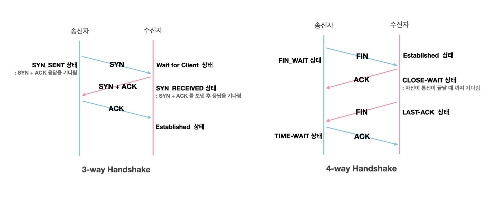

### REST

| 용어     | 설명                                                                                                                                                         |
| -------- | ------------------------------------------------------------------------------------------------------------------------------------------------------------ |
| REST     | - 주소와 행위로 자원을 컨트롤하는 통신 규약 - HTTP URI를 통해 자원을 명시하고, HTTP 메서드를 통해 자원에 대한 CRUD Operation을 적용하도록 설계된 아키텍처 |
| REST API | - REST의 설계 규약을 올바르게 지킨 API  - 서버는 클라이언트의 상태를 저장하지 않으며 각 요청은 독립적                                                     |

---

### HTTP 메서드와 역할

| Method | 역할                                                     |
| ------ | -------------------------------------------------------- |
| GET    | 서버에 존재하는 데이터를 요청                            |
| POST   | 서버에 데이터를 생성                                     |
| PUT    | 서버에 존재하는 데이터를 수정하거나 존재하지 않으면 생성 |
| PATCH  | 서버에 존재하는 데이터 일부 수정                         |
| DELETE | 서버에 존재하는 데이터 제거를 요청                       |

---

### 쿠키 VS 세션

> 보통 웹 환경에서는 클라이언트와 서버가 HTTP 프로토콜을 사용하여 통신 하지만, HTTP 프로토콜은  1. 비연결성 (HTTP가 TCP 연결을 맺고 요청을 보내면 서버는 응답을 보내고 연결이 끊어짐)  2. 무상태(HTTP는 상태를 따로 저장하지 않음) 때문에 응답을 보내면 상태 정보가 사라짐  -> 그래서 쿠키나 세션을 사용

| 구분             | 쿠키                                                   | 세션                                                 |
| ---------------- | ------------------------------------------------------ | ---------------------------------------------------- |
| 저장 위치        | 클라이언트(로컬, 브라우저)                             | 서버                                                 |
| 데이터 저장 형태 | 키 - 밸류가 들어있는 작은 데이터 파일                  | 서버에서 관리하는 세션 ID를 통해 사용자 정보 저장    |
| 통신 방식        | 웹 서버에 요청을 보낼 때 헤더에 실어 전송              | 서버가 클라이언트의 커넥션을 관리하여 세션 ID로 구분 |
| 유효기간         | 설정 가능, 브라우저 종료 후에도 정보 유지              | 브라우저 종료 시 삭제, 일정 기간 동안만 유지         |
| 특징             | 브라우저에 사용자 정보를 저장, 사용자별 정보 보관 가능 | 서버 자원 사용, 보안상 비교적 안전                   |

---

### 웹 브라우저의 캐싱 : 쿠키, 로컬 스토리지, 세션 스토리지

> 로컬 스토리지와 세션 스토리지는 클라이언트 측에서 사용자의 데이터를 저장하는 매커니즘

| 구분                              | 쿠키                                                                     | 로컬 스토리지                                          | 세션 스토리지                                        |
| --------------------------------- | ------------------------------------------------------------------------ | ------------------------------------------------------ | ---------------------------------------------------- |
| 정의                              | 웹 서버와의 상태를 유지하기 위해 사용자 브라우저에 저장되는 데이터 조각. | 웹 애플리케이션의 데이터를 브라우저에 영구적으로 저장. | 탭이 열려 있는 동안 브라우저에 저장되는 임시 데이터. |
| 최대 저장 용량                    | 4KB                                                                      | 5MB                                                    | 5MB                                                  |
| 브라우저 허용                     | HTML4 + 5                                                                | HTML5                                                  | HTML5                                                |
| 접근 범위                         | 창                                                                       | 창                                                     | 탭                                                   |
| 만료 기한                         | 수동으로 설정                                                            | 영구적                                                 | 탭 닫으면 소멸                                       |
| 설정할 수 있는 주체               | 서버 + 클라이언트                                                        | 클라이언트                                             | 클라이언트                                           |
| 요청과 함께 서버에 자동 전송 유무 | O                                                                        | X                                                      | X                                                    |

---

### 세션 VS 세션 스토리지 VS 로컬 스토리지

- 세션: 서버 측에서 사용자의 상태를 유지하고, 브라우저 종료 시 사라짐.
- 세션 스토리지: 클라이언트 측 탭 기반의 임시 저장소, 탭을 닫으면 데이터가 삭제됨.

---

### CORS

| 항목                                 | 설명                                                                                                                                |
| ------------------------------------ | ----------------------------------------------------------------------------------------------------------------------------------- |
| CORS (Cross Origin Resource Sharing) | 한 출처의 자원에서 다른 출처의 자원에 접근할 수 있도록 하는 웹 보안 메커니즘. 여기서 출처는 프로토콜, 호스트명, 포트의 조합을 의미. |
| CORS error                           | 다른 출처의 자원에 접근하려 할 때, 해당 출처에서 자원 공유를 허용하지 않는 경우 브라우저가 발생시키는 오류.                         |
| Preflight Request                    | 실제 요청을 서버에 보내기 전에, 해당 요청이 안전한지 확인하기 위해 브라우저가 서버에 보내는 사전 요청. (CORS를 허용하는지 확인)     |

---

### https://www.google.com/ 접속 시 발생하는 일

| STEP | 설명                                                                                                      |
| ---- | --------------------------------------------------------------------------------------------------------- |
| 0    | 리다이랙트, 캐싱(브라우저 캐싱, 프록시 서버의 캐싱)                                                       |
| 1    | DNS 조회 : DNS를 사용하셔 IP 주소를 조회                                                                  |
| 2    | TCP 연결: 반환받은 IP 주소를 사용해 TCP 연결. HTTPS 프로토콜 사용 시 기본 포트 443 (cf HTTP 기본 포트 80) |
| 3    | TLS/SSL 핸드세이크: 보안 연결. 클라이언트와 서버 간 보안 키 교환 및 암호화 방식 협상                      |
| 4    | HTTP 요청 전송: 브라우저가 HTTP GET 요청을 서버에 전송                                                    |
| 5    | 서버 응답 : HTTP 프로토콜을 활용해 HTTP 응답 메시지 생성. 웹 페이지를 구성하는 데이터를 응답으로 받음     |
| 6    | 브라우저 렌더링: 사용자에게 화면을 표시                                                                   |
|      |

---

### 기본 네트워크 용어

| 용어                                  | 설명                                                                                                           |
| ------------------------------------- | -------------------------------------------------------------------------------------------------------------- |
| **프로토콜 (Protocol)**               | 컴퓨터나 단말기 사이의 데이터 통신을 위한 통신 규약. 예: TCP, UDP                                              |
| **IP (Internet Protocol) 주소**       | 컴퓨터 네트워크에서 기기들이 서로를 인식하고 통신하기 위해 사용하는 식별 번호.                                 |
| **DNS (Domain Name System)**          | 도메인 이름과 매칭된 IP 주소를 확인하는 시스템. 호스트의 도메인 이름을 IP로 변환하거나 그 반대 과정을 수행.    |
| **URI (Uniform Resource Identifier)** | 네트워크 상 자원을 가리키는 고유 식별자. URL과 URN을 포함하는 더 넓은 개념.                                    |
| **URN (Uniform Resource Name)**       | 자원의 이름을 나타내며, 그 자원이 어디에 있든 그것을 식별할 수 있는 이름.                                      |
| **URL (Uniform Resource Locator)**    | 자원의 위치를 나타내며, 그 자원이 어떻게 접근할 수 있는지를 명시.                                              |
| **방화벽 (Firewall)**                 | 미리 정의된 보안 규칙을 바탕으로 들어오고 나가는 네트워크 트래픽을 모니터링하고 제어하는 네트워크 보안 시스템. |
| **네트워크**                          | 노드(서버, 라우터, 스위치)와 링크(와이파이, LAN)가 서로 연결되어 있으며 리소스를 공유하는 집합                 |
| **네트워크 분류**                     | LAN(근거리 통신망) < MAN(대도시 통신망) < WAN (광역 통신망)                                                    |
| **RTT(Round Trip Time)**              | 왕복 지연시간. 어떤 메시지가 두 장치 사이를 왕복하는데 걸린 시간                                               |

---

### IP & MAC

| 용어             | 설명                                                                                                                            |
| ---------------- | ------------------------------------------------------------------------------------------------------------------------------- |
| **IP 주소 종류** | 공인 IP는 전 세계에서 유일하며 외부 접근 가능. 사설 IP는 내부 네트워크 용도, 외부 접근 불가.                                    |
| **NAT 기술**     | Network Address Transaction, 로컬 네트워크의 모든 기기가 하나의 공개 IP로 외부 네트워크와 통신할 수 있게 하여 IP 부족 문제 해결 |
| **MAC 주소**     | 물리적 주소로 네트워크 인터페이스에 할당된 고유 식별자. 주로 NIC에 할당                                                         |
| **ARP**          | IP -> MAC으로 변환하는 프로토콜. 브로드캐스팅을 통해 IP에 해당하는 MAC을 찾아냄                                                 |
| **RARP**         | MAC -> IP변환하는 프로토콜                                                                                                      |

---

### 네트워크 성능 지표

| 용어                     | 설명                                                                                                    |
| ------------------------ | ------------------------------------------------------------------------------------------------------- |
| **트래픽**               | 특정 시점에 링크 내에 "흐르는" 데이터의 양. 단위 `bps`(bits per seconds)                                |
| **처리량(throughput)**   | 링크 내에서 성공적으로 전달된 데이터의 양. 얼만큼의 트래픽을 처리했는지 나타냄. 단위 `bps`              |
| **병목현상(Bottleneck)** | 트래픽에 의해 데이터 흐름이 제한되는 상황. 네트워크 토폴로지가 병목 현상을 해결하는 척도가 되기도 한다. |

---

### 핸드세이크

| 핸드세이크 유형          | 설명                                                                                                                                                                                                                                                                                                                                                                                                                                                                                                                                                                                                |
| ------------------------ | --------------------------------------------------------------------------------------------------------------------------------------------------------------------------------------------------------------------------------------------------------------------------------------------------------------------------------------------------------------------------------------------------------------------------------------------------------------------------------------------------------------------------------------------------------------------------------------------------- |
| **TCP 3-way 핸드세이크** | 가상 회선을 수립하는 과정.  1) 클라이언트가 서버에 SYN을 보내 연결 요청.  2) 서버는 SYN-ACK로 응답.  3) 클라이언트는 ACK로 응답하여 연결을 확립. 이 과정을 통해 양쪽 모두 데이터 전송 준비가 완료됨을 확인.                                                                                                                                                                                                                                                                                                                                                                                |
| **TCP 4-way 핸드세이크** | TCP 연결을 종료하는 과정.  1) 클라이언트가 FIN을 보내 연결 종료 요청.  2) 서버는 ACK로 응답, 클라이언트는 연결 종료 준비가 됨을 알림.  3) 서버에서 모든 데이터 전송이 완료되면 FIN을 클라이언트에게 전송.  4) 클라이언트는 ACK로 응답하며, 이후 연결 종료.                                                                                                                                                                                                                                                                                                                              |
| **SSL/TLS 핸드세이크**   | 보안된 연결을 수립하는 과정.  1) **Client Hello**: 클라이언트가 서버에게 SSL/TLS 연결 요청. 클라이언트가 지원하는 SSL/TLS 버전, 암호화 알고리즘 목록 포함  2) **Server Hello**: 서버가 SSL/TLS 연결 수락. 클라이언트가 지원하는 SSL/TLS 버전 중 하나 선택하고 서버의 인증서와 공개키를 클라이언트에게 전송  3) **인증서 검증 및 키 교환**: 클라이언트는 서버의 인증서 검증 후 서버의 공개키를 사용하여 세션 키 생성. 세션 키를 클라이언트의 공개키로 암호화하여 서버에게 전송  4) **암호화된 연결**: 클라이언트와 서버는 세션 키를 사용하여 대칭키 암호화 방식을 사용하여 통신을 암호화 |

---

### HTTP VS HTTPS

| 구분 | HTTP                                                                                                   | HTTPS                                                                                 |
| ---- | ------------------------------------------------------------------------------------------------------ | ------------------------------------------------------------------------------------- |
| 정의 | 클라이언트와 서버 간의 정보를 교환하기 위한 통신 규약(프로토콜). 데이터가 암호화되지 않은 채로 전송됨. | HTTP에 데이터 암호화가 추가된 프로토콜. 데이터 전송 전 안전한 연결을 설정.            |
| 특징 | 상태를 가지고 있지 않는 Stateless 프로토콜.                                                            | 대칭키와 비대칭키 암호화 방식을 사용하여 데이터를 암호화.(최초 1회만 비대칭키 암호화) |
| 보안 | 데이터가 암호화되지 않아 정보 유출 가능성이 있음.                                                      | SSL/TLS를 통해 데이터를 암호화하여 보안성이 높음.                                     |

---

### HTTP VS TCP

| HTTP               | TCP                |
| ------------------ | ------------------ |
| 비연결형 프로토콜  | 연결형 프로토콜    |
| 단방향 통신만 가능 | 양방향 통신 가능   |
| 응용 계층 프로토콜 | 전송 계층 프로토콜 |

---

### TCP VS UDP

| 구분      | TCP                                                                                         | UDP                                                                         |
| --------- | ------------------------------------------------------------------------------------------- | --------------------------------------------------------------------------- |
| 특성      | 연결 지향형 프로토콜, 가상 회선을 만들어 신뢰성 보장. 데이터를 보내고 그에 따른 응답을 받음 | 비연결 지향형 프로토콜, 신뢰성 보장하지 않음. 수신자로부터 응답을 받지 않음 |
| 속도      | 상대적으로 느림, 데이터의 순차적 전달과 신뢰성이 중요할 때 사용.                            | 상대적으로 빠름, 실시간 스트리밍 등 연속성이 중요한 서비스에 사용.          |
| 사용 사례 | 파일 전송, 이메일 전송 등 신뢰성이 중요한 경우.                                             | 비디오 스트리밍, 온라인 게임 등 실시간성이 중요한 경우.                     |

---

### HTTP의 발달

| 버전         | 주요 특징 및 개선점                                                                                                                                                                                                              |
| ------------ | -------------------------------------------------------------------------------------------------------------------------------------------------------------------------------------------------------------------------------- |
| **HTTP/1.0** | - 한 연결당 하나의 요청과 응답만 처리 가능.   - 연결을 맺고 끊는 과정에서 RTT(Round Trip Time) 지연이 큼.                                                                                                                     |
| **HTTP/1.1** | - 지속 연결(Persistent Connections)과 파이프라이닝(이전 요청의 응답이 완료되기 전에 여러 요청을 순차적으로 보낼 수 있는 기술)을 도입하여 연결 효율성 개선.   - Head-of-Line (HOL) 블로킹과 반복된 헤더 전송 문제 여전히 존재. |
| **HTTP/2**   | - 단일 연결에 여러 요청과 응답을 독립적으로 동시 처리 가능한 멀티플렉싱 지원.   - 스트림 우선순위 및 헤더 압축으로 효율성 증가.   - 서버 푸시 기능으로 더 빠른 리소스 로딩 지원.                                           |
| **HTTP/3**   | - UDP 기반의 QUIC 프로토콜 사용으로 연결 설정 시간 단축 및 RTT 감소.   - 전송 실패시 복구 메커니즘으로 성능 향상.   - 전반적인 속도와 안정성 개선에 초점.                                                                  |

---

### OSI 7계층, TCP/IP 4계층

- 네트워크 통신을 구성하는 요소를 7개/4개의 계층으로 표준화 한 것

| OSI 7계층 (계층명)  | 설명                                            | TCP/IP 4계층 매칭     | 데이터 단위                            |
| ------------------- | ----------------------------------------------- | --------------------- | -------------------------------------- |
| 7. 응용 계층        | 사용자와 직접 상호작용하는 응용 프로그램 포함   | 응용 계층 (HTTP 등)   | 데이터(Data)                           |
| 6. 표현 계층        | 데이터 형식 정의, 암호화 및 압축 처리           | 〃                    | 데이터(Data)                           |
| 5. 세션 계층        | 통신 세션 관리, 연결 유지 및 중단 처리          | 〃                    | 데이터(Data)                           |
| 4. 전송 계층        | 데이터의 오류 없는 순서대로 전달, 세그먼트 생성 | 전송 계층 (TCP, UDP)  | 세그먼트(Segment)/데이터그램(Datagram) |
| 3. 네트워크 계층    | 패킷 전송 및 라우팅 관리                        | 인터넷 계층 (IP, ARP) | 패킷(Packet)                           |
| 2. 데이터 링크 계층 | 물리적 주소 정의, 에러 검출 및 흐름 제어        | 링크 계층             | 프레임(Frame)                          |
| 1. 물리 계층        | 데이터를 전기 신호로 변환                       | 〃                    | 비트(Bit)                              |

---

### Graphql

| 항목                    | 설명                                                                                                                                                                                                                                      |
| ----------------------- | ----------------------------------------------------------------------------------------------------------------------------------------------------------------------------------------------------------------------------------------- |
| **GraphQL**             | REST API의 대안으로 사용되는 데이터 쿼리 및 조작 언어. 클라이언트가 필요한 데이터의 구조를 명시적으로 요청하여 서버로부터 받아올 수 있게 설계된 언어.                                                                                     |
| **특징**                | 하나의 엔드포인트를 통해 다양한 데이터 요청 및 조작이 가능. 클라이언트가 요청하는 데이터의 형태에 맞춰 정확히 그 데이터만을 응답으로 받아 효율적인 데이터 통신을 지원.                                                                    |
| **REST API와의 차이점** | REST는 리소스 간의 고정된 URL(엔드포인트)에 요청을 보내는 반면, GraphQL은 단일 엔드포인트를 통해 필요한 모든 데이터를 쿼리 형태로 요청. 이는 오버페칭(필요 이상의 데이터 요청) 및 언더페칭(필요한 데이터를 충분히 받지 못함) 문제를 해결. |
| **쿼리 (Query)**        | 데이터를 읽기 위한 요청. SQL의 SELECT문과 유사하며, 클라이언트가 요청한 형식과 정확히 일치하는 데이터를 검색하여 반환.                                                                                                                    |
| **변형 (Mutation)**     | 데이터를 생성(Create), 수정(Update), 삭제(Delete)하기 위한 요청. 서버 상의 데이터를 변경하는 작업을 수행.                                                                                                                                 |

---

### 메세지 전송 방식

| 방식         | 설명                                                             |
| ------------ | ---------------------------------------------------------------- |
| 유니캐스트   | 1:1 통신. 대표적으로 HTTP 통신. 가장 일반적인 네트워크 전송 형태 |
| 브로트캐스트 | 1:N 통신. 연결되어있는 모든 노드에게 데이터를 전달 ex) ARP       |
| 멀티캐스트   | 1:N 통신, 특정 그룹의 노드들에게만 데이터를 전달                 |

---
