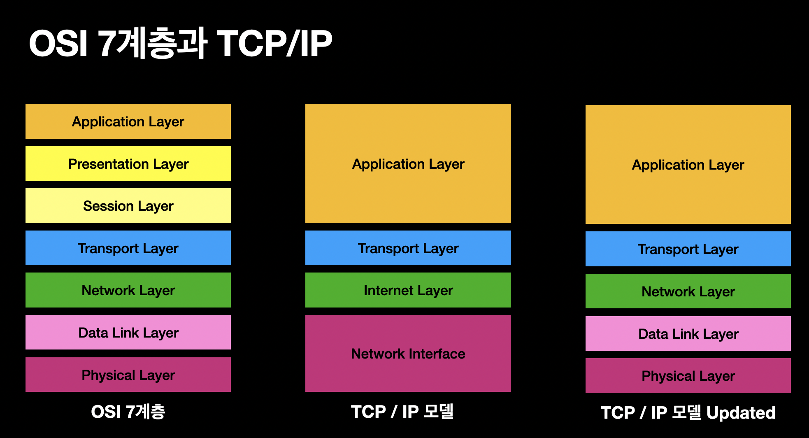
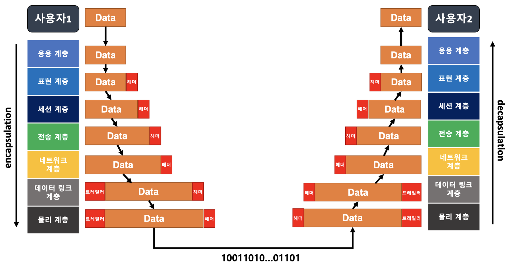
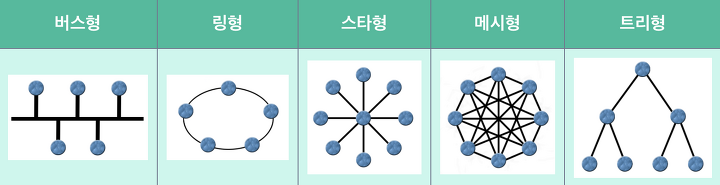

### 기본 네트워크 용어

| 용어                            | 설명                                                                                                                                                                                                                                                                                 |
| ------------------------------- | ------------------------------------------------------------------------------------------------------------------------------------------------------------------------------------------------------------------------------------------------------------------------------------ |
| **프로토콜 (Protocol)**         | 컴퓨터나 단말기 사이의 데이터 통신을 위한 통신 규약. 예: TCP, UDP                                                                                                                                                                                                                    |
| **IP (Internet Protocol) 주소** | 컴퓨터 네트워크에서 기기들이 서로를 인식하고 통신하기 위해 사용하는 식별 번호.                                                                                                                                                                                                       |
| **DNS (Domain Name System)**    | 도메인 이름과 매칭된 IP 주소를 확인하는 시스템. 호스트의 도메인 이름을 IP로 변환하거나 그 반대 과정을 수행.                                                                                                                                                                          |
| **URI VS URL VS URN**           | - URI(네트워크 상 자원을 가리키는 고유 식별자)는 URL과 URN을 포괄하는 넓은 개념. <br>- URL은 자원의 실제 위치(접근 방법 포함)를 명시하는 반면, URN은 위치와 무관하게 자원을 식별하는 데 초점. <br>- URL은 "어디에 있는가?"에 답하고, URN은 "무엇인가?"에 답하는 방식으로 자원을 식별 |
| **방화벽 (Firewall)**           | - 미리 정의된 보안 규칙을 바탕으로 들어오고 나가는 네트워크 트래픽을 모니터링하고 제어하는 네트워크 보안 시스템. <br>- 패킷 필터링, 프록시 서버로서의 기능 수행(클라이언트와 서버 간 직접적인 네트워크 연결을 방지하여 보안을 강화)                                                  |
| **네트워크**                    | 노드(서버, 라우터, 스위치)와 링크(와이파이, LAN)가 서로 연결되어 있으며 리소스를 공유하는 집합                                                                                                                                                                                       |
| **네트워크 분류**               | LAN(근거리 통신망) < MAN(대도시 통신망) < WAN (광역 통신망)                                                                                                                                                                                                                          |
| **RTT(Round Trip Time)**        | 왕복 지연시간. 어떤 메시지가 두 장치 사이를 왕복하는데 걸린 시간                                                                                                                                                                                                                     |

---

### OSI 7계층, TCP/IP 4계층

> OSI 7계층

- Open Systems Interconnection(개방형 시스템 상호연결)의 약자로, **네트워크에서 통신이 일어나는 과정**을 7계층으로 나눈 모델.
- 각 계층은 독립적이나, 상하구조 체계이기 때문에 윗 계층이 동작하기 위해서는 아래 계층들이 잘 동작해야 한다.

> TCP/IP 4계층

- 인터넷에서 컴퓨터들이 서로 정보를 주고받는데 쓰이는 프로토콜의 모음.



| OSI 7계층           | 상세 설명                                                                                                                                       | TCP/IP 4계층         | 데이터 단위 (PDU)   | 응용 프로토콜 예시  | 응용 프로그램 예시                                           |
| ------------------- | ----------------------------------------------------------------------------------------------------------------------------------------------- | -------------------- | ------------------- | ------------------- | ------------------------------------------------------------ |
| 7. 응용 계층        | 사용자가 네트워크 자원에 접근할 수 있게 해주며, 이메일과 웹 브라우징과 같은 네트워크 서비스를 제공                                              | 응용 계층            | 데이터(Data)        | HTTP, FTP, SMTP     | 웹 브라우저(크롬), 이메일 클라이언트(아웃룩), FTP 클라이언트 |
| 6. 표현 계층        | 데이터를 암호화, 압축 및 변환하여 애플리케이션 계층이 이해할 수 있는 형식으로 제공                                                              | 응용 계층            | 데이터(Data)        | SSL/TLS, JPEG, MPEG | 데이터 압축 및 암호화 도구                                   |
| 5. 세션 계층        | 응용 프로그램 간의 통신을 하기 위한 세션을 운영체제를 통해 설정, 관리 및 종료하여 여러 애플리케이션 간의 대화를 가능하게 함                     | 응용 계층            | 데이터(Data)        | NetBIOS, SOCKS      | API, 웹 브라우저 내 세션 관리                                |
| 4. 전송 계층        | 신뢰성 있는 데이터 전송을 보장(TCP)하고, 전송 속도를 조절하거나, 데이터의 오류 검사 및 순서화를 담당                                            | 전송 계층            | 세그먼트/데이터그램 | TCP, UDP            | VoIP 클라이언트, 스트리밍 서비스                             |
| 3. 네트워크 계층    | 전송할 패킷을 여러 개의 경로를 거쳐 목적지에 전송하는 계층 <br> 다양한 네트워크 간의 라우팅을 담당하며, 데이터 패킷의 전송 경로를 결정          | 인터넷 계층          | 패킷(Packet)        | IP, ICMP            | 라우터 설정 소프트웨어                                       |
| 2. 데이터 링크 계층 | 직접 연결된 이웃 컴퓨터와의 통신 <br> 네트워크 상의 두 장치 간의 데이터 전송을 직접 관리하며 물리 계층에서 발생한 오류 검출 및 흐름 제어를 수행 | 네트워크 엑세스 계층 | 프레임(Frame)       | Ethernet, PPP       | 네트워크 인터페이스 카드(NIC) 구성 소프트웨어                |
| 1. 물리 계층        | 전송 케이블과 같은 물리적 매체를 통해 데이터를 전송하는 역할을 함. <br> 0,1의 전기적 신호(비트)와 아날로그 시간을 변환하는 역할                 | 네트워크 엑세스 계층 | 비트(Bit)           | -                   | 케이블, 허브, 모뎀                                           |

---

#### 응용 계층 프로토콜 예시

| 프로토콜 | 역할                                                                                                                                                                                                                                               |
| -------- | -------------------------------------------------------------------------------------------------------------------------------------------------------------------------------------------------------------------------------------------------- |
| HTTP     | HyperText Transfer Protocol의 약자로 서버-클라이언트 모델을 따르면서 request/response 구조로 웹 상에서 정보를 주고받을 수 있는 프로토콜. TCP/IP 기반으로 작동하며 비연결성(응답 받으면 연결 종료)과 무상태성(이전 상태를 알 수 없음)의 특징을 가짐 |
| FTP      | 파일 전송 프로토콜. 서버와 클라이언트 간의 파일 전송을 위해 설계됨.                                                                                                                                                                                |
| SSH      | 네트워크 프로토콜 중 하나로, 다른 컴퓨터에 로그인하거나 네트워크 상에서 데이터를 안전하게 전송하기 위해 사용. 원격 호스트에 접속하기 위해 사용되는 보안 프로토콜                                                                                   |
| SMTP     | 이메일 전송을 위한 프로토콜. 이메일 서버 간의 메일 전송 및 클라이언트에서 메일 서버로 메일 발송 시 사용.                                                                                                                                           |

---

#### 인터넷 계층(네트워크 계층) 프로토콜 예시

| 프로토콜 | 역할                                                                                                                                     |
| -------- | ---------------------------------------------------------------------------------------------------------------------------------------- |
| IP       | 데이터 패킷을 송신자로부터 수신자까지 전달. IP 주소를 사용하여 소스와 목적지 식별, 데이터그램 형태로 정보 전송.                          |
| ARP      | 네트워크 상에서 IP 주소를 물리적인 MAC 주소로 변환. 로컬 네트워크(LAN) 내에서 데이터 패킷이 올바른 목적지에 도달하도록 함.               |
| ICMP     | 네트워크 상의 다른 호스트나 라우터의 통신 상태를 점검하고 오류 메시지를 전달. 목적지에 도달 불가, 과다한 트래픽 등의 상황에서 정보 제공. |

---

#### 캡슐화와 비캡슐화

> 사용자 1에서 사용자 2로 데이터를 전송하는 과정에서 캡슐화/역캡슐화 과정이 발생
> <br> <br>

| 항목     | 캡슐화 (Encapsulation)                                 | 비캡슐화 (Decapsulation)                               |
| -------- | ------------------------------------------------------ | ------------------------------------------------------ |
| **정의** | 데이터 전송을 위해 각 계층에서 헤더를 추가하는 과정    | 수신된 데이터에서 헤더를 제거하여 원본을 추출하는 과정 |
| **과정** | 애플리케이션 계층에서 물리 계층으로 내려가며 헤더 추가 | 물리 계층에서 애플리케이션 계층으로 올라가며 헤더 제거 |
| **목적** | 데이터를 안전하게 전송하고 구조화하기 위함             | 수신한 데이터를 정확하게 해석하고 사용하기 위함        |
| **예시** | HTTP 응답에 TCP와 IP 헤더를 추가하여 패킷 생성         | 패킷에서 IP와 TCP 헤더를 제거하여 HTTP 응답 추출       |

---

### HTTP VS HTTPS

| 구분 | HTTP                                                                                                   | HTTPS                                                                                 |
| ---- | ------------------------------------------------------------------------------------------------------ | ------------------------------------------------------------------------------------- |
| 정의 | 클라이언트와 서버 간의 정보를 교환하기 위한 통신 규약(프로토콜). 데이터가 암호화되지 않은 채로 전송됨. | HTTP에 데이터 암호화가 추가된 프로토콜. 데이터 전송 전 안전한 연결을 설정.            |
| 특징 | 상태를 가지고 있지 않는 Stateless 프로토콜.                                                            | 대칭키와 비대칭키 암호화 방식을 사용하여 데이터를 암호화.(최초 1회만 비대칭키 암호화) |
| 보안 | 데이터가 암호화되지 않아 정보 유출 가능성이 있음.                                                      | SSL/TLS를 통해 데이터를 암호화하여 보안성이 높음.                                     |

---

### HTTP VS TCP

| HTTP               | TCP                |
| ------------------ | ------------------ |
| 비연결형 프로토콜  | 연결형 프로토콜    |
| 단방향 통신만 가능 | 양방향 통신 가능   |
| 응용 계층 프로토콜 | 전송 계층 프로토콜 |

---

### HTTP의 발달

| 버전         | 주요 특징 및 개선점                                                                                                                                                   | 프로토콜 |
| ------------ | --------------------------------------------------------------------------------------------------------------------------------------------------------------------- | -------- |
| **HTTP/1.0** | - 한 연결당 하나의 요청과 응답만 처리 가능. <br> - 연결을 맺고 끊는 과정에서 RTT(Round Trip Time) 지연이 큼.                                                          | TCP      |
| **HTTP/1.1** | - 지속 연결(Persistent Connections)과 파이프라이닝을 도입하여 연결 효율성 개선. <br> - Head-of-Line (HOL) 블로킹과 반복된 헤더 전송 문제 여전히 존재.                 | TCP      |
| **HTTP/2**   | - 멀티플렉싱으로 단일 연결에 여러 요청과 응답 동시 처리 가능. <br> - 스트림 우선순위 및 헤더 압축으로 효율성 증가. <br> - 서버 푸시 기능 지원을 통해 빠른 리소스 로딩 | TCP      |
| **HTTP/3**   | - QUIC 프로토콜 사용으로 연결 설정 시간 단축 및 RTT 감소. <br> - 전송 실패 시 복구 메커니즘으로 성능 향상. <br> - 전반적인 속도와 안정성 개선에 초점.                 | UDP      |

```
- 파이프라이닝: 이전 요청의 응답이 완료되기 전에 여러 요청을 순차적으로 보냄
- Head-Of-Line 블로킹: 첫 요청이 막히면 뒤의 요청도 기라뎌야 함
- 멀티플랙싱: 단일 연결에 여러 요청과 응답을 독립적으로 처리 가능한 기술
- QUIC: UDP 기반 프로토콜
```

---

### HTTP 메서드와 역할

| Method | 역할                                                                                                                                         |
| ------ | -------------------------------------------------------------------------------------------------------------------------------------------- |
| GET    | 서버에 존재하는 데이터를 요청. 필요한 정보를 특정하기 위해 URL 뒤에 쿼리 스트링을 추가하여 정보를 조회. 브라우저 히스토리에 남아 캐시가 가능 |
| POST   | 서버에 데이터를 생성. 전달할 데이터를 body부분에 포함시켜 통신. 브라우저 히스토리에 남지 않음 캐시 불가능                                    |
| PUT    | 서버에 존재하는 데이터를 수정하거나 존재하지 않으면 생성                                                                                     |
| PATCH  | 서버에 존재하는 데이터 일부 수정                                                                                                             |
| DELETE | 서버에 존재하는 데이터 제거를 요청                                                                                                           |

---

### HTTP Status Code

> 클라이언트가 보낸 HTTP 요청에 대한 서버의 응답 코드, 상태 코드를 통해 요청의 성공/실패 여부 판단 가능

| 코드 | 설명                                                               |
| ---- | ------------------------------------------------------------------ |
| 200  | 요청에 성공함                                                      |
| 201  | 자원 생성 성공                                                     |
| 400  | Bad reqeust                                                        |
| 401  | Unauthorization , 인증되지 않은 상태에서 인증이 필요한 자원에 접근 |
| 403  | Forbidden, 인증된 상태에서 권한 없는 자원에 접근                   |
| 404  | Not Found, route나 자원을 찾을 수 없음                             |
| 502  | Bad Gateway , 서버에서 예상치못한 에러 발생                        |

---

### REST

| 용어     | 설명                                                                                                                                                         |
| -------- | ------------------------------------------------------------------------------------------------------------------------------------------------------------ |
| REST     | - 주소와 행위로 자원을 컨트롤하는 통신 규약<br>- HTTP URI를 통해 자원을 명시하고, HTTP 메서드를 통해 자원에 대한 CRUD Operation을 적용하도록 설계된 아키텍처 |
| REST API | - REST의 설계 규약을 올바르게 지킨 API <br>- 서버는 클라이언트의 상태를 저장하지 않으며 각 요청은 독립적                                                     |

---

### 쿠키 VS 세션

> 보통 웹 환경에서는 클라이언트와 서버가 HTTP 프로토콜을 사용하여 통신 하지만, HTTP 프로토콜은 <br>1. 비연결성 (HTTP가 TCP 연결을 맺고 요청을 보내면 서버는 응답을 보내고 연결이 끊어짐) <br>2. 무상태(HTTP는 상태를 따로 저장하지 않음) 때문에 응답을 보내면 상태 정보가 사라짐 <br>-> 그래서 쿠키나 세션을 사용

| 구분             | 쿠키                                                                                   | 세션                                                              |
| ---------------- | -------------------------------------------------------------------------------------- | ----------------------------------------------------------------- |
| 저장 위치        | 클라이언트(로컬, 브라우저)                                                             | 서버                                                              |
| 데이터 저장 형태 | 키 - 밸류가 들어있는 작은 데이터 파일                                                  | 서버에서 관리하는 세션 ID를 통해 사용자 정보 저장                 |
| 통신 방식        | 웹 서버에 요청을 보낼 때 헤더에 실어 전송                                              | 서버가 클라이언트의 커넥션을 관리하여 세션 ID로 구분              |
| 유효기간         | 설정 가능, 브라우저 종료 후에도 정보 유지                                              | 브라우저 종료 시 삭제, 일정 기간 동안만 유지                      |
| 특징             | 브라우저에 사용자 정보를 저장, 사용자별 정보 보관 가능                                 | 서버 자원 사용, 보안상 비교적 안전                                |
| 사용 예          | 사용자 인증 상태 유지, 사용자 선호 언어 설정, 쇼핑몰의 장바구니 정보 저장              | 로그인 세션 유지, 사용자별 데이터 처리(예: 장바구니, 설정)        |
| 장점             | 서버에 부담을 주지 않고 빠른 데이터 접근이 가능, 사용자에 따라 커스텀 데이터 저장 가능 | 데이터가 서버에 저장되어 보안이 강화됨, 대량의 데이터 저장이 가능 |

---

### 웹 브라우저의 캐싱 : 쿠키, 로컬 스토리지, 세션 스토리지

> 모두 클라이언트 측에서 사용자의 데이터를 저장하는 매커니즘

| 구분                              | 쿠키                                                                          | 로컬 스토리지                                               | 세션 스토리지                                            |
| --------------------------------- | ----------------------------------------------------------------------------- | ----------------------------------------------------------- | -------------------------------------------------------- |
| 정의                              | 웹 서버와의 상태를 유지하기 위해 사용자 브라우저에 저장되는 데이터 조각(4KB). | 웹 애플리케이션의 데이터(5MB)를 브라우저에 영구적으로 저장. | 탭이 열려 있는 동안 브라우저에 저장되는 임시 데이터(5MB) |
| 브라우저 허용                     | HTML4 + 5                                                                     | HTML5                                                       | HTML5                                                    |
| 접근 범위                         | 창                                                                            | 창                                                          | 탭                                                       |
| 만료 기한                         | 수동으로 설정                                                                 | 영구적                                                      | 탭 닫으면 소멸                                           |
| 설정할 수 있는 주체               | 서버 + 클라이언트                                                             | 클라이언트                                                  | 클라이언트                                               |
| 요청과 함께 서버에 자동 전송 유무 | O                                                                             | X                                                           | X                                                        |

---

### 세션 VS 세션 스토리지

- 세션: 서버 측에서 사용자의 상태를 유지하고, 브라우저 종료 시 사라짐.
- 세션 스토리지: 클라이언트 측 탭 기반의 임시 저장소, 탭을 닫으면 데이터가 삭제됨.

---

### CORS

| 항목                                 | 설명                                                                                                                                |
| ------------------------------------ | ----------------------------------------------------------------------------------------------------------------------------------- |
| CORS (Cross Origin Resource Sharing) | 한 출처의 자원에서 다른 출처의 자원에 접근할 수 있도록 하는 웹 보안 메커니즘. 여기서 출처는 프로토콜, 호스트명, 포트의 조합을 의미. |
| CORS error                           | 다른 출처의 자원에 접근하려 할 때, 해당 출처에서 자원 공유를 허용하지 않는 경우 브라우저가 발생시키는 오류.                         |
| Preflight Request                    | 실제 요청을 서버에 보내기 전에, 해당 요청이 안전한지 확인하기 위해 브라우저가 서버에 보내는 사전 요청. (CORS를 허용하는지 확인)     |

---

### https://www.google.com/ 접속 시 발생하는 일

| STEP | 설명                                                                                                      |
| ---- | --------------------------------------------------------------------------------------------------------- |
| 0    | 리다이랙트, 캐싱(브라우저 캐싱, 프록시 서버의 캐싱)                                                       |
| 1    | DNS 조회 : DNS를 사용하셔 IP 주소를 조회                                                                  |
| 2    | TCP 연결: 반환받은 IP 주소를 사용해 TCP 연결. HTTPS 프로토콜 사용 시 기본 포트 443 (cf HTTP 기본 포트 80) |
| 3    | TLS/SSL 핸드세이크: 보안 연결. 클라이언트와 서버 간 보안 키 교환 및 암호화 방식 협상                      |
| 4    | HTTP 요청 전송: 브라우저가 HTTP GET 요청을 서버에 전송                                                    |
| 5    | 서버 응답 : HTTP 프로토콜을 활용해 HTTP 응답 메시지 생성. 웹 페이지를 구성하는 데이터를 응답으로 받음     |
| 6    | 브라우저 렌더링: 사용자에게 화면을 표시                                                                   |
|      |

---

### IP & MAC

| 용어             | 설명                                                                                                                            |
| ---------------- | ------------------------------------------------------------------------------------------------------------------------------- |
| **IP 주소 종류** | 공인 IP는 전 세계에서 유일하며 외부 접근 가능. 사설 IP는 내부 네트워크 용도, 외부 접근 불가.                                    |
| **NAT 기술**     | Network Address Transaction, 로컬 네트워크의 모든 기기가 하나의 공개 IP로 외부 네트워크와 통신할 수 있게 하여 IP 부족 문제 해결 |
| **MAC 주소**     | 물리적 주소로 네트워크 인터페이스에 할당된 고유 식별자. 주로 NIC에 할당                                                         |
| **ARP**          | IP -> MAC으로 변환하는 프로토콜. 브로드캐스팅을 통해 IP에 해당하는 MAC을 찾아냄                                                 |
| **RARP**         | MAC -> IP변환하는 프로토콜                                                                                                      |

---

### 네트워크 성능 지표

| 용어                     | 설명                                                                                                                                      |
| ------------------------ | ----------------------------------------------------------------------------------------------------------------------------------------- |
| **트래픽**               | 특정 시점에 링크 내에 "흐르는" 데이터의 양. 단위 `bps`(bits per seconds)                                                                  |
| **처리량(throughput)**   | 링크 내에서 성공적으로 전달된 데이터의 양. 얼만큼의 트래픽을 처리했는지 나타냄. 단위 `bps`                                                |
| **병목현상(Bottleneck)** | 트래픽에 의해 데이터 흐름이 제한되는 상황. (핫스팟) 네트워크 토폴로지가 병목 현상을 해결하는 척도가 되기도 한다.                          |
| **대역폭(Bandwidth)**    | 주어진 시간 동안 네트워크 연결을 통해 흐를 수 있는 최대 비트 수. 최대로 처리할 수 있는 트래픽. 대략적인 최대 동시 접속자 수 유추하는 척도 |

---

### 핸드세이크

> TCP 통신 과정: 3 way handshake -> data transfer -> 4 way handshake <br><br> 

| 핸드세이크 유형          | 설명                                                                                                                                                                                                                                                                                                                                                                                                                                                                                                          |
| ------------------------ | ------------------------------------------------------------------------------------------------------------------------------------------------------------------------------------------------------------------------------------------------------------------------------------------------------------------------------------------------------------------------------------------------------------------------------------------------------------------------------------------------------------- |
| **TCP 3-way 핸드세이크** | TCP/IP 프로토콜로 통신하기 전, 정확한 정보 전송을 위해 상대방 컴퓨터와 세션을 (가상 회선을) 수립하는 과정. <br>1) 클라이언트가 서버에 SYN을 보내 연결 요청. <br>2) 서버는 SYN-ACK로 응답. <br>3) 클라이언트는 ACK로 응답하여 연결을 확립. 이 과정을 통해 양쪽 모두 데이터 전송 준비가 완료됨을 확인.                                                                                                                                                                                                          |
| **TCP 4-way 핸드세이크** | TCP 연결을 종료하는 과정. <br>1) 클라이언트가 FIN을 보내 연결 종료 요청. <br>2) 서버는 ACK로 응답, 클라이언트는 연결 종료 준비가 됨을 알림. <br>3) 서버에서 모든 데이터 전송이 완료되면 FIN을 클라이언트에게 전송. <br>4) 클라이언트는 ACK로 응답하며, 이후 연결 종료.                                                                                                                                                                                                                                        |
| **SSL/TLS 핸드세이크**   | 서버와 클라이언트 간 보안된 연결을 수립하는 과정. <br>1) 클라이언트 헬로: 클라이언트가 사용 가능한 암호화 알고리즘과 SSL/TLS 버전 정보를 서버에 전송 <br>2) 서버 헬로: 서버는 암호화 알고리즘과 버전을 선택하고, 자신의 인증서를 클라이언트에게 보냄 <br>3) 인증서 검증: 클라이언트는 서버의 인증서를 검증하여 서버의 신원을 확인. <br>4) 키 교환: 클라이언트와 서버는 통신 암호화에 사용될 세션 키를 생성 (비대칭키 암호화 1회)<br>5) 세션 시작: 양쪽이 세션 키를 사용하여 암호화된 연결 시작(대칭키 암호화) |

---

### TCP VS UDP

| 구분      | TCP                                                                                                                                                                                                | UDP                                                                                                                                     |
| --------- | -------------------------------------------------------------------------------------------------------------------------------------------------------------------------------------------------- | --------------------------------------------------------------------------------------------------------------------------------------- |
| 특성      | 연결 지향형 프로토콜, 가상 회선을 만들어 신뢰성 보장(3 way handshake). 데이터를 보내고 그에 따른 응답을 받음. 순서에 맞고 오류 없이, 손실 없이 전송하는 것을 보장(by 오류제어, 흐름제어, 혼잡제어) | 비연결 지향형 프로토콜, 신뢰성 보장하지 않음. 수신자로부터 응답을 받지 않음. 오류제어, 흐름제어, 혼잡제어 제공하지 않는 간단한 프로토콜 |
| 속도      | 상대적으로 느림, 데이터의 순차적 전달과 신뢰성이 중요할 때 사용.                                                                                                                                   | 상대적으로 빠름, 실시간 스트리밍 등 연속성이 중요한 서비스에 사용.                                                                      |
| 사용 사례 | 파일 전송, 이메일 전송 등 신뢰성이 중요한 경우.                                                                                                                                                    | 비디오 스트리밍, 온라인 게임 등 실시간성이 중요한 경우.                                                                                 |

---

### IPv4와 IPv6 비교

> **IPv6**는 주소 공간 확장, 보안 향상, 통신 효율성 증가 등 IPv4의 한계를 극복.
> <br>- IPSec: 네트워크에서의 안전한 연결을 설정하기 위한 통신 규칙

| 특징      | IPv4                                         | IPv6                                                                    |
| --------- | -------------------------------------------- | ----------------------------------------------------------------------- |
| 주소 길이 | 32비트                                       | 128비트                                                                 |
| 주소 표현 | 8비트 단위 4개의 옥텟 (예: 192.168.0.1)      | 16비트씩 8개 구분, 16진수 (예: 2001:0db8:85a3:0000:0000:8a2e:0370:7334) |
| 주소 개수 | 약 41억 개                                   | 2^128개                                                                 |
| 보안      | 기본적으로 IPsec 지원 안 함                  | 기본적으로 IPsec 지원                                                   |
| 속도      | 불필요한 헤더로 인해 상대적으로 느릴 수 있음 | 더 큰 패킷 사이즈와 불필요한 헤더 없음으로 인해 일반적으로 빠름         |
| 추가 기능 | 없음                                         | 자동 구성, 주소 할당, 네트워크 계층 보안 내장 등                        |

---

### 클래스풀 IP 주소 배정

> 클래스풀 IP 주소 배정: IP 주소를 A, B, C, D, E의 5가지 클래스로 구분하여 할당하는 방식. 이 구분은 네트워크의 크기에 따라 다른 범위의 IP 주소를 할당할 수 있게 해준다. 예를 들어, 대규모 네트워크에는 클래스 A 주소를, 중소규모 네트워크에는 클래스 B 또는 C 주소를 할당 <br>-> IP 주소 공간을 효율적으로 관리하고, 네트워크의 크기와 필요에 따라 적절한 주소 할당을 가능하게 하기 위함

| 클래스         | 범위                        | 네트워크 ID / 호스트 ID | 사용 가능 호스트 수      |
| -------------- | --------------------------- | ----------------------- | ------------------------ |
| A              | 1.0.0.0 ~ 126.0.0.0         | 8 / 24 비트             | 2^24 - 2 (약 1,670만 개) |
| B              | 128.0.0.0 ~ 191.255.0.0     | 16 / 16 비트            | 2^16 - 2 (약 6.5만 개)   |
| C              | 192.0.0.0 ~ 223.255.255.0   | 24 / 8 비트             | 2^8 - 2 (254개)          |
| D (멀티캐스트) | 224.0.0.0 ~ 239.255.255.255 | N/A                     | N/A                      |
| E (예약됨)     | 240.0.0.0 ~ 255.255.255.255 | N/A                     | N/A                      |

---

#### 사용 가능 호스트 계산에서 -2를 하는 이유

> 네트워크 주소와 브로드캐스트 주소를 제외하기 때문

- 네트워크 주소: 각 서브넷의 첫 번째 주소. 네트워크 자체를 식별하는데 사용. 호스트 ID 부분이 모두 0으로 설정된 주소
- 브로드캐스트 주소: 각 서브넷의 마지막 주소. 이 주소를 통해 한 네트워크에 속한 모드 장치에 데이터를 한 번에 보낼 수 있음. 호스트 ID 부분이 모두 1로 설정된 주소

---

#### 클래스 D, E?

- 클래스 D: 멀티케스트 통신에 사용되는 IP 주소. 특정 그룹의 장치에 데이터를 동시 전송하는데 사용. 인터넷 TV 방송 등
- 클래스 E: 실험적인 용도로 예약되어 있으며 일반적으로는 사용되지 않음

---

### 서브네팅과 클래스리스

> **클래스풀 주소 배정**은 네트워크의 크기에 따라 비효율적인 IP 할당이 문제였으나, **클래스리스** 방식과 **서브네팅**을 통해 해결, 네트워크 주소의 낭비를 줄이고 보다 유연한 IP 관리 가능.

| 개념                     | 설명                                                                                                                                                                                                           |
| ------------------------ | -------------------------------------------------------------------------------------------------------------------------------------------------------------------------------------------------------------- |
| **클래스리스 주소 할당** | 기존 클래스 A, B, C와 같은 고정된 클래스를 사용하지 않고, 서브넷 마스크를 사용하여 네트워크의 크기와 구조에 따라 IP 주소를 할당. 네트워크의 주소 공간을 더 유연하게 활용, IP 주소의 낭비를 줄임                |
| **서브넷 마스크**        | 네트워크 ID와 호스트 ID를 구분하며, 네트워크를 세분화하는 비트 마스크. 이 마스크를 통해 단일 IP 클래스 내에서도 네트워크를 더 작은 단위로 세분화 가능. 각 세분화돈 네트워크(서브넷)은 독립적으로 라우팅이 가능 |
| **서브네팅**             | 네트워크를 더 작은 네트워크로 분할하는 과정. <br> EX) 하나의 큰 네트워크를 여러 개의 작은 네트워크로 나누어 각 부서나 그룹별로 다른 네트워크를 할당.                                                           |

---

### 메세지 전송 방식

| 방식         | 설명                                                             |
| ------------ | ---------------------------------------------------------------- |
| 유니캐스트   | 1:1 통신. 대표적으로 HTTP 통신. 가장 일반적인 네트워크 전송 형태 |
| 브로트캐스트 | 1:N 통신. 연결되어있는 모든 노드에게 데이터를 전달 ex) ARP       |
| 멀티캐스트   | 1:N 통신, 특정 그룹의 노드들에게만 데이터를 전달                 |

---

### 네트워크 토폴로지

> 노드와 링크의 구성 방식 <br><br> 

| 종류          | 특징                                                                                                                                                                          |
| ------------- | ----------------------------------------------------------------------------------------------------------------------------------------------------------------------------- |
| 버스 토폴로지 | - 하나의 회선에 여러개의 노드 <br>- 하나의 노드에 장애 발생해도 다른 노드에 영향 X <br>- 메인 링크 망가지면 큰 문제                                                           |
| 링형 토폴로지 | - 노드 추가, 삭제가 쉬움 <br>- 토큰을 기반으로 연속적으로 노드를 거치며, 통신 권한 여부를 따지고 권한 있으면 데이터 전달받음 <br>- 링크 또는 노드 하나만 고장나도 전체에 영향 |
| 스타 토폴로지 | - 노드 추가, 삭제 쉬움 <br> - 안정성이 높음. 다른 노드로 가려면 중앙 노드를 거쳐야 하고 중앙 노드의 방화벽 존재                                                               |
| 매시 토폴로지 | - 노드 추가, 삭제 어려움 (노드 하나 지울때 지워야 하는 링크가 너무 많음) <br>- 안정성이 높고 트래픽 분산 가능하나 비용이 고가                                                 |
| 트리 토폴로지 | - 계층적 토폴로지로 노드 확장이 용이. <br>- 리프 노드의 에러는 괜찮으나 루트 노드 문제시 전체에 문제.                                                                         |

---

### CRC와 체크섬

| 항목                              | 설명                                                                                                                                                                     | OSI 7계층                   |
| --------------------------------- | ------------------------------------------------------------------------------------------------------------------------------------------------------------------------ | --------------------------- |
| **CRC (Cyclic Redundancy Check)** | 데이터 전송 중 오류를 감지하기 위한 방법. 데이터를 특정 다항식으로 나누어 오류를 검출. 네트워크, 파일 시스템, 데이터 저장 장치 등에서 사용 됨.                           | 데이터 링크 계층, 물리 계층 |
| **체크섬**                        | 데이터 전송 시 데이터의 각 부분을 합산하여 오류를 검출하는 간단한 방법. 주로 IP, TCP, UDP 헤더에 사용되며, 구현이 쉽고 계산 비용이 낮으나 오류 검출 능력이 CRC보다 낮음. | 네트워크 계층, 전송 계층    |

---

### MTU, MSS, PMTUD

| 항목                                | 설명                                                                                                                                    |
| ----------------------------------- | --------------------------------------------------------------------------------------------------------------------------------------- |
| **MTU (Maximum Transmission Unit)** | 네트워크를 통해 전송될 수 있는 데이터의 최대 단위. 네트워크 인터페이스에 따라 다르며, 너무 큰 데이터는 분할되어 전송.                   |
| **MSS (Maximum Segment Size)**      | TCP 세그먼트에서 데이터 부분(payload)의 최대 크기. 일반적으로 MTU에서 IP와 TCP 헤더의 크기를 제외한 값.                                 |
| **PMTUD (Path MTU Discovery)**      | 패킷의 최대 전송 단위를 결정하는 과정. 데이터 패킷의 분할 및 재조합을 방지하며 네트워크를 통한 데이터 전송의 효율성을 높이기 위해 사용. |

---

### Graphql

| 항목                    | 설명                                                                                                                |
| ----------------------- | ------------------------------------------------------------------------------------------------------------------- |
| **GraphQL**             | 데이터 쿼리 및 조작 언어로, 클라이언트가 필요한 데이터의 구조를 명시적으로 요청하여 효율적인 통신을 지원.           |
| **특징**                | 단일 엔드포인트 사용으로 다양한 데이터 요청 및 조작 가능.                                                           |
| **REST API와의 차이점** | REST는 고정된 엔드포인트에 요청을 보내는 반면, GraphQL은 필요한 데이터만을 요청하는 단일 쿼리를 통해 데이터를 요청. |
| **쿼리와 변형**         | 쿼리는 데이터 읽기 작업에, 변형(Mutation)은 데이터 생성, 수정, 삭제 작업에 사용.                                    |

---

### 라우팅

| 용어              | 설명                                                                                                    |
| ----------------- | ------------------------------------------------------------------------------------------------------- |
| **라우팅**        | 데이터를 최적의 경로로 전달하는 과정.                                                                   |
| **라우터**        | 여러 네트워크를 연결하고 데이터를 전달하는 장치. 라우팅 테이블을 사용하여 작동.                         |
| **라우팅 테이블** | 라우터에서 목적지 IP 주소에 따라 데이터 패킷을 어디로 전송할지 결정하는 데 사용되는 정보가 담긴 테이블. |
| **게이트웨이**    | 서로 다른 네트워크 간의 통신을 가능하게 하는 장치 또는 노드. 라우터의 한 형태                           |
| **홉 (hop)**      | 데이터가 목적지까지 전송되기 위해 거쳐야 하는 중간 지점(라우터, 게이트웨이)의 수를 의미.                |

#### 라우터와 게이트웨이의 차이점

- 라우터는 주로 같은 타입의 네트워크 간의 라우팅을 담당, 게이트웨이는 다른 타입의 네트워크 간의 인터페이스 역할
- 라우터는 프로토콜 변환을 수행하지 않고 같은 프로토콜을 사용하는 네트워크 간에 패킷을 전송, 반면 게이트웨이는 프로토콜 간의 변환을 수행. 게이트웨이는 프로토콜 변환 뿐 아니라 데이터 포맷 변환, 메시지 크기 변환 등 다양한 변환 작업 처리 가능

---

#### 라우팅 테이블 구성 요소

| 구성 요소               | 설명                                                                                                                    |
| ----------------------- | ----------------------------------------------------------------------------------------------------------------------- |
| **Network Destination** | 패킷이 도달해야 하는 목적지 네트워크의 IP 주소 범위.                                                                    |
| **Netmask**             | 목적지 IP 주소를 네트워크 주소와 호스트 주소로 구분하는데 사용되는 마스크.                                              |
| **Gateway**             | 패킷이 다음 네트워크로 이동하기 위해 거쳐야 하는 중간 지점. 목적지가 로컬 네트워크에 없을 경우 사용되는 다음 홉의 주소. |
| **Interface**           | 패킷이 해당 네트워크로 전송되기 위해 사용되는 네트워크 인터페이스.                                                      |
| **Metric**              | 경로 선택 시 사용되는 비용 또는 거리를 나타내며, 낮은 값일수록 경로의 우선순위가 높음                                   |

---
