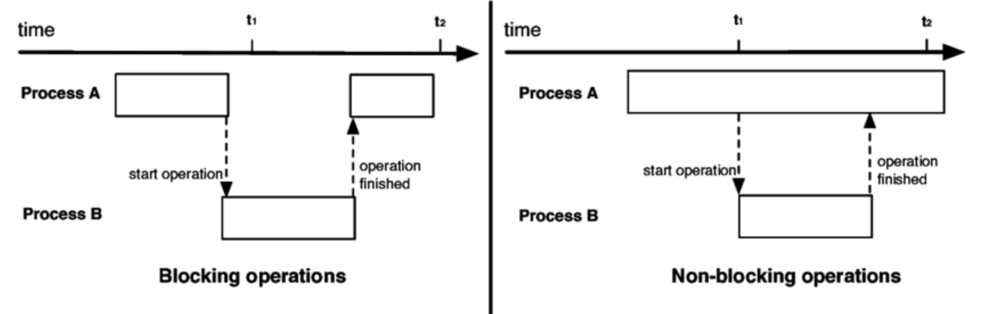

### 프로세스 VS 스레드

| 구분            | 프로세스                                                                                              | 스레드                                                                                            |
| --------------- | ----------------------------------------------------------------------------------------------------- | ------------------------------------------------------------------------------------------------- |
| 정의            | 실행 중인 프로그램의 인스턴스. 실행 파일(program)이 메모리에 적재되어 CPU에 의해 실행되는 것          | 프로세스 내에서 실행되는 실행의 흐름.                                                             |
| 메모리 공간     | 독립적인 메모리 공간(코드, 데이터, 힙, 스택)을 가짐.                                                  | 프로세스의 메모리 공간(코드, 데이터, 힙) 공유. 스택만 별도로 할당.                                |
| 자원 할당       | 운영체제로부터 자원을 할당 받음.                                                                      | 프로세스로부터 자원을 공유하여 사용.                                                              |
| 실행의 독립성   | 각 프로세스는 서로 독립적. 하나의 프로세스가 다른 프로세스의 자원에 직접 접근하는 것은 허용되지 않음. | 하나의 프로세스 내에서 여러 스레드가 실행되며, 프로세스의 자원을 공유.                            |
| 컨텍스트 스위칭 | 비교적 느림. 프로세스 간 컨텍스트 스위칭 시 많은 자원 및 시간 소모.                                   | 비교적 빠름. 스레드 간 컨텍스트 스위칭은 적은 자원을 사용하며 효율적.                             |
| 공유 및 통신    | IPC(Inter-Process Communication) 방식을 통해 통신.                                                    | 동일 프로세스 내 스레드끼리는 직접 데이터 공유 가능.                                              |
| 사용 사례       | 복잡한 작업을 처리하거나 여러 작업을 동시에 실행할 때 사용.                                           | 프로세스 내에서 여러 작업을 동시에 처리해야 할 때, 특히 공유된 자원에 대한 작업이 필요할 때 사용. |

---

### 프로세스 메모리 공간

> memory: CPU가 직접 접근할 수 있는 컴퓨터 내부의 기억 장치로 program이 CPU에서 실행되려면 memory에 적재된 상태여야 한다.   각 프로세스는 code, data, stack, heap 4개의 영역을 할당 받음

| 메모리 공간 | 설명                                                             |
| ----------- | ---------------------------------------------------------------- |
| code 영역   | 실행한 프로그램의 코드가 저장되는 메모리 영역                    |
| data 영역   | 프로그램의 전역 변수와 static 변수가 저장되는 메모리 영역        |
| heap 영역   | 프로그래머가 직접 공간을 할당/해제하는 메모리 영역               |
| stack 영역  | 함수 호출 시 생성되는 지역 변수와 매개 변수가 저장되는 임시 공간 |

---

### CPU 연산과 PC register

| 항목               | 설명                                                                                                                                                                           |
| ------------------ | ------------------------------------------------------------------------------------------------------------------------------------------------------------------------------ |
| **PC Register**    | CPU 내부에 존재하며,, **다음에 실행될 코드의 주소값**을 저장하고 있다.                                                                                                         |
| **연산 실행 방법** | PC Register가 가리키는 메모리 주소의 명령어를 CPU가 읽어와 연산을 수행함으로써 프로세스가 실행된다.                                                                            |
| **메모리의 역할**  | 프로세스 코드 영역에는 실행할 명령어(Instruction)들이 저장되어 있으며, PC Register는 이 영역의 명령어 중 **다음 번 연산에서 읽어야 할 명령어의 주소값**을 순차적으로 가리킨다. |
| **프로세스 실행**  | CPU는 메모리에 적재된 프로세스 코드 영역에서 PC Register에 의해 가리켜진 명령어를 가져와서 연산을 수행함으로써 프로세스를 실행한다.                                            |

---

### 동기/ 비동기/ 블로킹/ 논블로킹

| 개념          | 설명                                                                                                                                                                                                                                                                                                                                                                           |
| ------------- | ------------------------------------------------------------------------------------------------------------------------------------------------------------------------------------------------------------------------------------------------------------------------------------------------------------------------------------------------------------------------------ |
| 동기          | - 현재 실행 중인 작업이 **완료될 때까지 다음 작업이 기다려야** 하는 방식.  - **작업의 처리 순서**가 보장되며, 여러 스레드가 동시에 공유 지원에 접근하는 것을 막기 때문에 Thread safety 하다 - 어떤 작업이 많은 시간을 소요할 경우, 전체 시스템의 효율성이 저하                                                                                                           |
| 비동기(Async) | - 현재 실행 중인 작업의 **완료를 기다리지 않고, 다음 작업을 바로 시작**.  - 동시에 여러 작업을 처리할 수 있게 하여 전체적인 시스템의 처리량을 향상시키지만, 작업의 완료 순서를 보장하기 어렵고, 동시성 관리가 필요  - CPU나 메모리를 많이 사용하는 경우 과부하 발생  - Thread safety하지 않음  - Callback이나 프로미스 등의 매커니즘을 사용하여 비동기 결과를 처리 |
| 블로킹        | - 요청한 작업(예: 데이터 읽기, 쓰기)이 **완료될 때까지 호출한 함수가 제어권을 반환하지 않음**  - 즉 특정한 작업이 완료될 때까지 현재 스레드의 실행을 중단                                                                                                                                                                                                                   |
| 논블로킹      | - 요청한 작업을 시작하고 바로 **제어권을 반환**.  - 특정 작업 요청 시 해당 요청이 즉시 처리되거나 거절될 수 있으며 요청 작업의 완료를 기다리지 않고 즉시 다음 명령어로 넘어갈 수 있음                                                                                                                                                                                       |

> 동기와 비동기
> 

> 블로킹과 논블로킹
> 

> 동기와 블로킹: 둘 다 작업의 완료를 기다린다는 공통점. 하지만, 동기는 '작업 순서 및 완료에 대한 기대'에 초점을 맞춘 반면, 블로킹은 '작업 요청 시 제어권의 반환 여부'에 초점.

> 비동기와 논블로킹: 작업의 완료를 기다리지 않는다는 공통점. 비동기는 '여러 작업을 동시에 처리하는 방식'에 초점을 두고, 논블로킹은 '함수 호출이 즉시 반환되어, 다음 코드 라인으로 넘어갈 수 있음'에 초점

---

### 멀티 프로세스

| 개념                     | 설명                                                                                                                                                                                                                                                      |
| ------------------------ | --------------------------------------------------------------------------------------------------------------------------------------------------------------------------------------------------------------------------------------------------------- |
| **동시성 (Concurrency)** | *단일 CPU 코어*에서 여러 프로세스가 번갈아 가며 실행되는 것. 짧은 시간 간격으로 여러 프로세스를 처리하여 **시분할 시스템**을 통해 동시에 실행되는 것처럼 보임.                                                                                            |
| **병렬성 (Parallelism)** | *다중 CPU 코어*에서 각각의 코어가 독립적인 프로세스를 동시에 연산하여 실제로 여러 프로세스가 동시에 실행됨.                                                                                                                                               |
| **멀티 프로세스**        | 각 프로세스가 독립된 메모리 영역을 가지고, CPU는 한 시점에 하나의 프로세스만을 연산한다. PC(Register)는 현재 실행 중인 프로세스의 코드 영역을 가리키며, 프로세스 전환 시 PC의 가리키는 위치를 변경하여 다른 프로세스의 명령어를 연산한다. (동시성과 관련) |

---

### 컨텍스트 스위칭

- 프로세스 또는 스레드의 상태를 저장하고 복원하는 과정. 프로세스의 중단, 재시작
- 한 Task 가 끝날 때까지 기다리는 것이 아니라 여러 작업을 번갈아가며 실행해서 동시에 처리할 수 있도록 하는 방법

---

### 멀티 스레드 프로그래밍

| 개념                       | 설명                                                                                                                                                                                                                                                                                                                   | 해결 방법                                                                                                                                                                                                                                                                                                                                             |
| -------------------------- | ---------------------------------------------------------------------------------------------------------------------------------------------------------------------------------------------------------------------------------------------------------------------------------------------------------------------- | ----------------------------------------------------------------------------------------------------------------------------------------------------------------------------------------------------------------------------------------------------------------------------------------------------------------------------------------------------- |
| 멀티 스레드 프로그래밍     | - 하나의 프로세스 내에서 여러 스레드를 생성하여 자원 사용의 중복을 최소화하는 기법.  - 멀티 프로세스 대비 메모리 사용량이 적고, 스레드 간 통신이 용이.  - 스레드 간 컨텍스트 스위칭이 효율적이지만, 한 스레드의 오류가 다른 스레드에 영향을 미칠 수 있으며, 교착상태와 경쟁 상태 같은 동시성 이슈에 주의해야 함. | -                                                                                                                                                                                                                                                                                                                                                     |
| 교착 상태 (Deadlock)       | 서로 다른 프로세스 또는 스레드가 서로 점유하고 있는 자원의 반납을 기다리며 발생하는 상태                                                                                                                                                                                                                               | - 예방 기법: 상호 배제(한 시점에 하나의 스레드나 프로세스만 특정 자원 사용), 점유와 대기(할당된 자원이 있는 상태에서 다른 프로세스에 자원을 요청하며 대기), 비선점, 순환 대기(순환적으로 서로 자원을 요구) 조건을 제거  - 회피 기법: 은행원 알고리즘(안정 상태에서만 자원을 할당)  - 탐지 및 복구: 교착 상태 탐지 알고리즘과 교착 상태에서 회복 |
| 경쟁 상태 (Race Condition) | 두 개 이상의 프로세스나 스레드가 동시에 공유 자원을 읽거나 쓸 때, 결과의 올바름이 실행 순서에 따라 달라질 수 있는 상태                                                                                                                                                                                                 | - 잠금(Locking) 메커니즘 사용 - 원자적(Atomic) 연산 사용 - 스레드 동기화 기법(예: 뮤텍스, 세마포어) 사용                                                                                                                                                                                                                                        |
| 기아 상태 (Starvation)     | 여러 프로세스나 스레드가 자원을 점유하기 위해 경쟁할 때, 특정 프로세스나 스레드가 영원히 자원 할당을 받지 못하는 상태                                                                                                                                                                                                  | - 우선순위를 동적으로 조정하여 낮은 우선순위의 프로세스도 자원을 할당받을 수 있게 함 - 우선순위가 아닌 순서대로 자원을 할당하는 방법 사용(예: 순환 대기 큐)                                                                                                                                                                                        |

---

### Thread safety

| 개념          | 설명                                                                                                                                                                                                                                                |
| ------------- | --------------------------------------------------------------------------------------------------------------------------------------------------------------------------------------------------------------------------------------------------- |
| Thread Safety | - 프로그램의 코드가 여러 스레드에 의해 동시에 실행될 때도, 의도한 대로 정확하게 동작하고 예측 가능한 결과를 생성하는 특성을 의미. (여러 스레드가 동시에 같은 객체에 접근해도 데이터의 일관성을 유지해야)  - 인스턴스 변수의 사용을 지양해야 한다 |

---

### 프로세스 동기화

| 개념            | 설명                                                                                                                                                         |
| --------------- | ------------------------------------------------------------------------------------------------------------------------------------------------------------ |
| 프로세스 동기화 | - 다중 프로세스 환경에서 하나의 자원에 대한 동시 접근을 제어하여 데이터의 일관성과 무결성을 보장  - 프로세스 간의 협력 및 경쟁 상태를 해결하기 위해 필요. |

---

### 스레드 동기화

> 멀디 스레딩 환경에서 여러 스레드가 동시에 공유 자원에 접근 시 발생할 수 있는 문제들을 해결하는 방법

| 개념                | 설명                                                                                                                                                                       |
| ------------------- | -------------------------------------------------------------------------------------------------------------------------------------------------------------------------- |
| 뮤택스(Mutex)       | - 공유자원에 대한 접근을 제어하기 위해 잠금(lock)과 잠금 해제(unlock)매커니즘을 사용  - 한 시점에 하나의 프로세스나 스레드만이 임계 영역에 접근 가능                    |
| 세마포어(Semaphore) | - 정수 카운터를 사용하여 여러 프로세스나 스레드가 공유 자원에 접근할 수 있도록 관리                                                                                        |
| 모니터(Monitor)     | 공유자원에 대한 접근을 메서드 단위로 추상화하여 매서드가 실행되는 동안 자동으로 락을 관리   - 한 번에 하나의 스레드만 이 공유자원에 접근 가능. 상호배제가 자동으로 보장 |

---

### 가상 메모리와 캐시

| 개념        | 설명                                                                                                                                                                                                                                                                            |
| ----------- | ------------------------------------------------------------------------------------------------------------------------------------------------------------------------------------------------------------------------------------------------------------------------------- |
| 가상 메모리 | - 프로세스가 실제 메모리 크기와 상관없이 메모리를 이용할 수 있도록 하는 시스템.  - 실제 메모리(RAM)와 보조 저장 장치의 swap 영역을 활용하여 프로세스에게 더 큰 메모리 공간을 제공                                                                                            |
| 캐시        | - 빠른 접근이 필요한 데이터나 자주 사용하는 데이터를 임시로 저장해 두는 공간으로, 데이터 접근 시간을 줄이고 시스템의 성능을 향상. - CPU 캐시, 웹 캐시 등 다양한 형태가 있으며, 레지스터보다는 느리지만 메인 메모리보다는 빠름.  - 계층 구조를 통한 비용, 자원 효율적 사용 |

---

### 캐싱이 중요한 이유, 구현 방법

- 캐싱은 데이터 또는 계산 결과를 임시 저장하여 빠른 접근을 가능하게 함으로써 성능을 향상시킴.
- 데이터베이스 쿼리, API 호출 결과 등을 캐시에 저장하여, 동일한 요청이 있을 때 빠르게 응답 가능
- Redis와 같은 인메모리 데이터 스토어를 사용하여 캐시 구현 가능

---

### Scale up과 Scale Out의 차이

| 구분      | 설명                                                                             |
| --------- | -------------------------------------------------------------------------------- |
| Scale Up  | - 시스템의 리소스 (CPU, RAM)을 늘려 성능을 향상.  - 하드웨어의 한계 도달 가능 |
| Scale Out | - 인스턴스의 수를 늘려 처리 능력을 확장.  - 분산 시스템의 복잡성 증가         |

---
