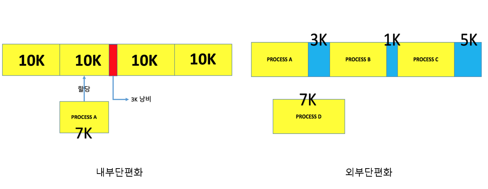

## 핵심: 프로세스 vs 스레드

| 구분 | 프로세스 | 스레드 |
|------|----------|--------|
| **메모리 공간** | 독립적 (Code, Data, Heap, Stack) | 공유 (Code, Data, Heap) + 독립적 Stack |
| **통신 방식** | IPC (Inter-Process Communication) | 직접 메모리 공유 |
| **생성 비용** | 높음 | 낮음 |
| **컨텍스트 스위칭** | 느림 (많은 자원 소모) | 빠름 (적은 자원 소모) |
| **안정성** | 높음 (독립적 실행) | 낮음 (한 스레드 오류가 전체 영향) |

### 프로세스 메모리 구조

| 영역 | 용도 | 특징 |
|------|------|------|
| **Code** | 실행 코드 | 읽기 전용 |
| **Data** | 전역변수, static 변수 | 컴파일 시 크기 결정 |
| **Heap** | 동적 할당 메모리 | 런타임에 크기 변경 |
| **Stack** | 지역변수, 함수 호출 | LIFO 구조 |

---

## 핵심: 동기/비동기

### 동기/비동기 vs 블로킹/논블로킹

| 구분 | 동기 | 비동기 |
|------|------|--------|
| **특징** | 작업 완료까지 대기 | 완료를 기다리지 않고 다음 작업 진행 |
| **순서 보장** | O | X |
| **Thread Safety** | O | X |
| **성능** | 처리량 제한적 | 높은 처리량 가능 |

| 구분 | 블로킹 | 논블로킹 |
|------|--------|----------|
| **제어권** | 완료까지 제어권 반환 안함 | 즉시 제어권 반환 |
| **대기** | 작업 완료까지 대기 | 즉시 다음 코드 실행 |
| **I/O 처리** | I/O 완료까지 멈춤 | I/O와 관계없이 진행 |

**핵심 차이점**:
- **동기/비동기**: 작업 순서와 완료에 대한 관심사
- **블로킹/논블로킹**: 제어권 반환에 대한 관심사

---

### 멀티 프로세스

| 개념                     | 설명                                                                                                                                                                                                                                                              |
| ------------------------ | ----------------------------------------------------------------------------------------------------------------------------------------------------------------------------------------------------------------------------------------------------------------- |
| **동시성 (Concurrency)** | *단일 CPU 코어*에서 여러 프로세스가 번갈아 가며 실행되는 것. 짧은 시간 간격으로 여러 프로세스를 처리하여 **시분할 시스템**을 통해 동시에 실행되는 것처럼 보임.                                                                                                    |
| **병렬성 (Parallelism)** | *다중 CPU 코어*에서 각각의 코어가 독립적인 프로세스를 동시에 연산하여 실제로 여러 프로세스가 동시에 실행됨.                                                                                                                                                       |
| **멀티 프로세스**        | 각 프로세스가 독립된 메모리 영역을 가지고, CPU는 한 시점에 하나의 프로세스만을 연산한다. PC 레지스터는 현재 실행 중인 프로세스의 코드 영역을 가리키며, 프로세스 전환 시 PC 레지스터의 가리키는 위치를 변경하여 다른 프로세스의 명령어를 연산한다. (동시성과 관련) |

---

### 프로세스 관리와 PCB(Process Control Block)의 역할

| 용어                            | 설명                                                                                                                                                                                            |
| ------------------------------- | ----------------------------------------------------------------------------------------------------------------------------------------------------------------------------------------------- |
| **시분할 시스템**               | 한 프로세스가 CPU를 매우 짧은 시간 동안 점유한 후, 다른 프로세스에게 CPU 사용권을 넘기고, 자신의 차례가 다시 오면 이어서 명령을 수행하는 시스템. 여러 프로세스가 동시에 실행되는 것처럼 보인다. |
| **Context**                     | 프로세스가 현재 어떤 상태로 수행되고 있는지에 대한 총체적인 정보. 이전 명령 수행 위치, 레지스터 상태 등 포함.                                                                                   |
| **PCB (Process Control Block)** | 프로세스의 Context 정보를 저장하는 곳. 프로세스 상태, 프로그램 카운터, CPU 레지스터 정보, 메모리 한계 등 포함.                                                                                  |

---

### PCB에 저장되는 정보

| 정보                                     | 설명                                                                                |
| ---------------------------------------- | ----------------------------------------------------------------------------------- |
| **프로세스 상태(Process State)**         | 프로세스의 현재 상태(새로운(new), 실행 중(running), 대기 중(waiting), 종료(halted)) |
| **프로세스 번호(Process Number)**        | 프로세스 식별자                                                                     |
| **프로그램 카운터(Program Counter, PC)** | 프로세스가 다음에 실행할 명령어의 주소                                              |
| **레지스터(Registers)**                  | CPU 레지스터의 현재 값을 저장, 연산 중간 결과 등 포함                               |
| **메모리 한계(Memory Limits)**           | 프로세스가 사용하는 메모리의 범위                                                   |

---

#### 프로세스 상태와 생명 주기

> 프로세스의 생명 주기는 프로세스 상태(Process State)에 따라 달라진다. 프로세스는 대체로 다음과 같은 상태를 거친다:

| 프로세스 상태                   | 설명                                                                   |
| ------------------------------- | ---------------------------------------------------------------------- |
| **새로운 (New)**                | 프로세스가 생성되고 초기화되는 단계.                                   |
| **준비 완료 (Ready)**           | CPU를 할당받기 위해 대기하는 프로세스의 상태. 실행을 위해 준비된 상태. |
| **실행 중 (Running)**           | 프로세스가 CPU를 할당받아 명령어를 실행하는 상태.                      |
| **대기 중 (Waiting)**           | 입출력 작업과 같은 이벤트가 완료될 때까지 기다리는 상태.               |
| **종료 (Terminated or Halted)** | 프로세스의 실행이 완료되어 종료된 상태.                                |

---

### 컨텍스트 스위칭

| 용어                | 설명                                                                                                                                                                                                                                                                                                                                                                    |
| ------------------- | ----------------------------------------------------------------------------------------------------------------------------------------------------------------------------------------------------------------------------------------------------------------------------------------------------------------------------------------------------------------------- |
| **컨텍스트 스위칭** | 한 프로세스/스레드에서 다른 프로세스/스레드로 CPU 제어권을 넘겨주는 과정. 이전 프로세스/스레드의 상태는 PCB에 저장되어 보관되며, 새로운 프로세스/스레드의 PCB 정보를 읽어 그 상태를 복구한다.  즉,프로세스/스레드의 상태를 저장하고 복원하는 과정으로, 프로세스/스레드의 중단과 재시작을 관리한다. 이를 통해 여러 작업을 번갈아 가며 실행하여 동시에 처리할 수 있다. |
| **작업 방식**       | 한 태스크가 끝날 때까지 기다리지 않고, 여러 작업을 번갈아가며 실행해서 동시에 처리                                                                                                                                                                                                                                                                                      |

---

### 멀티 프로세스 환경에서 process 간 데이터 교환 (IPC)

> 프로세스는 원칙적으로 독립된 주소 공간을 가지므로, 다른 프로세스의 주소 공간을 직접 참조할 수 없다. 하지만, 운영체제는 프로세스 간 자원 접근을 위한 특별한 매커니즘인 프로세스 간 통신(IPC, Inter Process Communication)을 제공.

| IPC 방식                         | 설명                                                                                                                                                                                                                                                          |
| -------------------------------- | ------------------------------------------------------------------------------------------------------------------------------------------------------------------------------------------------------------------------------------------------------------- |
| **공유 메모리(Shared Memory)**   | 프로세스들이 주소 공간의 일부를 공유하는 방식. 커널이 공유 메모리 영역을 할당해주고, 이후 프로세스들은 커널의 도움 없이 이 메모리 영역에 접근할 수 있다. 이 방식은 빠른 데이터 교환을 가능하게 하지만, 동시 접근에 따른 일관성 유지를 위한 동기화가 필요하다. |
| **메시지 전달(Message Passing)** | 시스템 호출을 통해 커널을 경유하여 메시지를 전달하는 방식. 프로세스는 `send`와 `receive` 연산을 통해 메시지를 교환한다. 이 방법은 메모리 공유보다 속도가 느리지만, 데이터 교환 시 충돌을 회피할 필요가 없어 적은 양의 데이터를 교환할 때 유용하다.            |

---

### 멀티 스레드 환경의 메모리 구조와 PC 레지스터

> 스레드 간 code, data, heap 영역은 공유, 스택 메모리, pc 레지스터 영역은 공유하지 않음

| 구성 요소                                 | 설명                                                                                                                                                                                                           |
| ----------------------------------------- | -------------------------------------------------------------------------------------------------------------------------------------------------------------------------------------------------------------- |
| **스택 메모리(Stack Memory)**             | 각 스레드는 함수 호출 시 인자 전달, 리턴 주소 저장, 함수 내 지역 변수 저장 등을 위해 **독립적인 스택 메모리 공간**을 필요로 한다. 이로 인해 스레드는 프로세스로부터 스택 메모리 영역을 독립적으로 할당 받는다. |
| **PC 레지스터(Program Counter Register)** | 각 스레드마다 **독립적인 PC 레지스터**를 가지고 있어야 한다. 이는 프로세스 내의 각 스레드가 독립적인 실행 흐름을 가지며, 스레드 간 컨텍스트 스위치가 일어나기 때문이다.                                        |
| **공유 메모리 영역**                      | 스레드는 **코드(Code), 데이터(Data), 힙(Heap) 영역**을 프로세스 내의 다른 스레드와 공유한다. 이는 스레드 간 효율적인 자원 공유와 통신을 가능하게 하며, 메모리 사용량을 최적화한다.                             |

---

### 멀티 스레드 프로그래밍

| 개념                   | 설명                                                                                                                                                                                                                                                                                                                   |
| ---------------------- | ---------------------------------------------------------------------------------------------------------------------------------------------------------------------------------------------------------------------------------------------------------------------------------------------------------------------- |
| 멀티 스레드 프로그래밍 | - 하나의 프로세스 내에서 여러 스레드를 생성하여 자원 사용의 중복을 최소화하는 기법.  - 멀티 프로세스 대비 메모리 사용량이 적고, 스레드 간 통신이 용이.  - 스레드 간 컨텍스트 스위칭이 효율적이지만, 한 스레드의 오류가 다른 스레드에 영향을 미칠 수 있으며, 교착상태와 경쟁 상태 같은 동시성 이슈에 주의해야 함. |

### 멀티 스레드 및 멀티 프로세스 프로그래밍의 동시성 문제와 해결

| 개념                       | 설명                                                                                                                   | 해결 방법                                                                                                                                                                                                                                                                                                                                                                                                                                                                                                  |
| -------------------------- | ---------------------------------------------------------------------------------------------------------------------- | ---------------------------------------------------------------------------------------------------------------------------------------------------------------------------------------------------------------------------------------------------------------------------------------------------------------------------------------------------------------------------------------------------------------------------------------------------------------------------------------------------------- |
| 교착 상태 (Deadlock)       | 서로 다른 프로세스 또는 스레드가 서로 점유하고 있는 자원의 반납을 기다리며 발생하는 상태 (무한 대기 상태)              | - 무시기법: deadlock 발생 확률 낮은 시스템에서 deadlock을 무시 - 예방 기법: 상호 배제(한 시점에 하나의 스레드나 프로세스만 특정 자원 사용), 점유와 대기(할당된 자원이 있는 상태에서 다른 프로세스에 자원을 요청하며 대기), 비선점(다른 thread가 사용중인 자원을 강제로 선점 불가), 순환 대기(순환적으로 서로 자원을 요구) 조건을 제거. 4개의 조건은 deadlock의 발생 조건  - 회피 기법: 은행원 알고리즘(안정 상태에서만 자원을 할당)  - 탐지 및 복구: 교착 상태 탐지 알고리즘과 교착 상태에서 회복 |
| 경쟁 상태 (Race Condition) | 두 개 이상의 프로세스나 스레드가 동시에 공유 자원을 읽거나 쓸 때, 결과의 올바름이 실행 순서에 따라 달라질 수 있는 상태 | - 잠금(Locking) 메커니즘 사용 - 원자적(Atomic) 연산 사용 - 스레드 동기화 기법(예: 뮤텍스, 세마포어) 사용                                                                                                                                                                                                                                                                                                                                                                                             |
| 기아 상태 (Starvation)     | 여러 프로세스나 스레드가 자원을 점유하기 위해 경쟁할 때, 특정 프로세스나 스레드가 영원히 자원 할당을 받지 못하는 상태  | - 우선순위를 동적으로 조정하여 낮은 우선순위의 프로세스도 자원을 할당받을 수 있게 함 - 우선순위가 아닌 순서대로 자원을 할당하는 방법 사용(예: 순환 대기 큐)                                                                                                                                                                                                                                                                                                                                             |

---

### Thread safety

| 개념          | 설명                                                                                                                                                                                                                                                |
| ------------- | --------------------------------------------------------------------------------------------------------------------------------------------------------------------------------------------------------------------------------------------------- |
| Thread Safety | - 프로그램의 코드가 여러 스레드에 의해 동시에 실행될 때도, 의도한 대로 정확하게 동작하고 예측 가능한 결과를 생성하는 특성을 의미. (여러 스레드가 동시에 같은 객체에 접근해도 데이터의 일관성을 유지해야)  - 인스턴스 변수의 사용을 지양해야 한다 |

---

### 멀티 프로세스/스레드 환경에서의 동기화

> 동기화는 멀티 프로세스와 멀티 스레드 환경에서 데이터의 일관성과 무결성을 유지하기 위해 필수적. 여기에는 뮤텍스, 세마포어, 모니터 등 다양한 방법이 사용

| 기법                            | 설명                                                                                                                                                                                                                                                                                                                                                        |
| ------------------------------- | ----------------------------------------------------------------------------------------------------------------------------------------------------------------------------------------------------------------------------------------------------------------------------------------------------------------------------------------------------------- |
| **임계영역 (Critical section)** | - 둘 이상의 process/thread가 동시에 동일한 자원에 접근하도록 하는 프로그램 코드 부분으로 한 process/thread가 자신의 임계 구역에서 수행하는 동안에는 다른 process/thread는 그들의 임계 구역에 들어갈 수 없어야 한다. 즉 임계 영역의 원자성이 보장되어야 한다.                                                                                                |
| **뮤텍스 (Mutex)**              | - 공유 자원에 접근할 수 있는 프로세스/스레드의 수를 1개로 제한한다.  - 임계 영역을 보호하고 경쟁 상태를 방지하기 위해 mutex lock을 사용한다.  - 프로세스/스레드가 임계 영역에 들어가기 전에 반드시 lock을 획득하고, 나올 때 lock을 반환해야 한다.                                                                                                     |
| **세마포어 (Semaphore)**        | - 공유 자원에 접근할 수 있는 프로세스/스레드의 개수를 2개 이상으로 할 수 있다.  - 정수 카운터를 사용하여 공유 자원에 접근할 수 있는 스레드의 수를 관리한다.  - S가 0보다 크면 임계 영역에 들어갈 수 있으며, S값은 입장 시 1 감소, 퇴장 시 1 증가한다.  - 세마포어가 0 또는 1의 값만 가질 수 있는 경우, 이진 세마포어로 뮤텍스와 유사하게 작동한다. |
| **모니터 (Monitor)**            | - 공유 자원에 대한 접근을 메서드 단위로 추상화하여, 메서드 실행 중 자동으로 락을 관리한다.  - 한 번에 하나의 스레드만이 공유 자원에 접근할 수 있으며, 상호 배제가 자동으로 보장된다.                                                                                                                                                                     |

---

### Paging VS Segementation : 메모리 관리 전략

| 용어                           | 설명                                                                                                                                                                                                                                                                                         |
| ------------------------------ | -------------------------------------------------------------------------------------------------------------------------------------------------------------------------------------------------------------------------------------------------------------------------------------------- |
| **페이징(Paging)**             | 물리 메모리를 고정 크기의 페이지 프레임으로 나누고, 가상 메모리도 같은 크기의 페이지로 나누어 관리하는 메모리 관리 기법. 프로세스는 연속적인 메모리 공간에 있지 않아도 실행될 수 있다.                                                                                                       |
| **내부 단편화**                | 페이징에서 발생하는 현상으로, 페이지 크기가 고정되어 있어 프로세스의 메모리 요구 사항과 페이지 크기가 정확히 일치하지 않을 때 할당된 페이지의 일부가 사용되지 않고 남게 된다. 예를 들어, 페이지 크기가 4KB이고 프로세스가 10KB를 요구할 경우, 3개의 페이지(12KB)가 할당되고 2KB가 남게 된다. |
| **세그멘테이션(Segmentation)** | 프로세스가 할당 받은 메모리 공간을 논리적 의미 단위(세그먼트)로 나누는 방식. 코드, 데이터, 힙, 스택 등의 단위로 세그먼트를 정의하며, 각 세그먼트는 연속된 메모리 공간을 차지한다.                                                                                                            |
| **외부 단편화**                | 세그멘테이션에서 발생할 수 있는 현상으로, 할당과 해제가 반복되며 사용 가능한 메모리 공간이 충분함에도 불구하고, 연속된 공간이 아니기 때문에 새로운 세그먼트를 할당할 수 없는 상황.                                                                                                           |

---

### 페이지 폴트, 페이지 교체 알고리즘, 요구 페이징

| 용어                           | 설명                                                                                                                                                                                                                                                                                                                                                                          |
| ------------------------------ | ----------------------------------------------------------------------------------------------------------------------------------------------------------------------------------------------------------------------------------------------------------------------------------------------------------------------------------------------------------------------------- |
| **페이지 폴트(Page Fault)**    | 프로세스 실행 중 접근하려는 페이지가 물리 메모리(RAM)에 없어 발생하는 상황. 이 때, 운영체제는 해당 페이지를 디스크에서 찾아 물리 메모리로 불러와야 한다. 페이지 폴트는 메모리 접근 패턴과 관리 전략에 따라 발생률이 달라지며, 시스템 성능에 중요한 영향을 미칠 수 있다.                                                                                                       |
| **페이지 교체 알고리즘**       | 물리 메모리가 가득 차 있을 때, 어떤 페이지를 제거하고 새 페이지를 불러올지 결정하는 방법. 페이지 폴트 발생 시 시스템의 성능 저하를 최소화하기 위해 사용된다. 대표적인 알고리즘으로는 FIFO (First-In, First-Out), LRU (Least Recently Used), Clock, 그리고 Optimal 알고리즘이 있다.                                                                                            |
| **요구 페이징(Demand Paging)** | 프로세스가 실제로 필요로 하는 페이지만을 메모리에 적재하는 기법. 이는 모든 프로세스의 페이지를 물리 메모리에 적재하는 대신, 실제로 접근이 요구될 때 페이지를 메모리로 불러오는 방식으로, 메모리 사용의 효율성을 높이고 전체적인 시스템 성능을 개선하는 데 기여한다. 요구 페이징은 페이지 폴트 메커니즘을 통해 구현되며, 이 과정에서 적절한 페이지 교체 알고리즘이 필수적이다. |

---

### 주요 페이지 교체 알고리즘

| 알고리즘                        | 설명                                                                                                                                        |
| ------------------------------- | ------------------------------------------------------------------------------------------------------------------------------------------- |
| **FIFO (First-In, First-Out)**  | 메모리에 가장 오래 전에 로드된 페이지를 처음으로 교체하는 방식. 가장 간단하지만, 자주 사용되는 페이지라도 교체될 수 있다는 단점이 있다.     |
| **LRU (Least Recently Used)**   | 가장 오랫동안 사용되지 않은 페이지를 교체하는 방식. 실제 페이지의 사용 패턴을 반영하여 보다 효율적인 교체를 시도한다.                       |
| **Optimal** (최적 페이지 교체)  | 미래에 가장 오랫동안 사용되지 않을 페이지를 교체하는 이상적인 방식. 실제 시스템에서는 미래의 사용 패턴을 예측하기 어려워 구현이 불가능하다. |
| **LFU (Least Frequently Used)** | 참조 횟수가 가장 적은 page를 교체한다. 비용 대비 성능이 좋지 않아 잘 쓰이지 않는다                                                          |

---

### 가상 메모리와 캐시

| 개념        | 설명                                                                                                                                                                                                                                                                            |
| ----------- | ------------------------------------------------------------------------------------------------------------------------------------------------------------------------------------------------------------------------------------------------------------------------------- |
| 가상 메모리 | - 프로세스가 실제 메모리 크기와 상관없이 메모리를 이용할 수 있도록 하는 시스템.  - 실제 메모리(RAM)와 보조 저장 장치의 swap 영역을 활용하여 프로세스에게 더 큰 메모리 공간을 제공                                                                                            |
| 캐시        | - 빠른 접근이 필요한 데이터나 자주 사용하는 데이터를 임시로 저장해 두는 공간으로, 데이터 접근 시간을 줄이고 시스템의 성능을 향상. - CPU 캐시, 웹 캐시 등 다양한 형태가 있으며, 레지스터보다는 느리지만 메인 메모리보다는 빠름.  - 계층 구조를 통한 비용, 자원 효율적 사용 |

---

### 캐싱이 중요한 이유, 구현 방법

- 캐싱은 데이터 또는 계산 결과를 임시 저장하여 빠른 접근을 가능하게 함으로써 성능을 향상시킴.
- 데이터베이스 쿼리, API 호출 결과 등을 캐시에 저장하여, 동일한 요청이 있을 때 빠르게 응답 가능
- Redis와 같은 인메모리 데이터 스토어를 사용하여 캐시 구현 가능

---

### Scale up과 Scale Out의 차이

| 구분      | 설명                                                                             |
| --------- | -------------------------------------------------------------------------------- |
| Scale Up  | - 시스템의 리소스 (CPU, RAM)을 늘려 성능을 향상.  - 하드웨어의 한계 도달 가능 |
| Scale Out | - 인스턴스의 수를 늘려 처리 능력을 확장.  - 분산 시스템의 복잡성 증가         |

---
