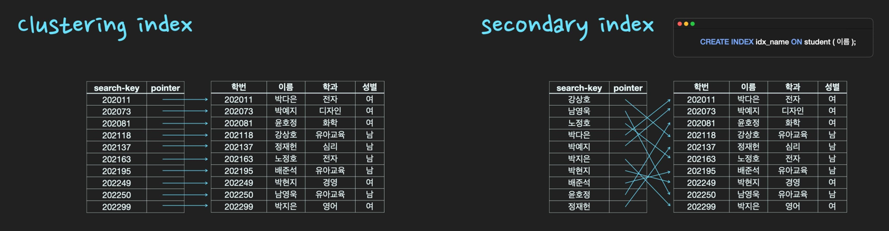
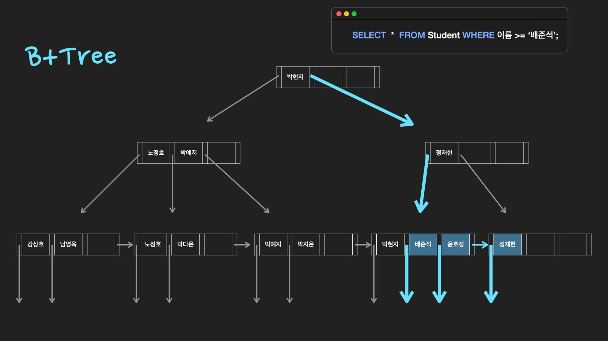

### 테이블 키의 종류


| 종류                  | 설명                                                                                                                                                                                                |
| --------------------- | --------------------------------------------------------------------------------------------------------------------------------------------------------------------------------------------------- |
| Primary key (기본키)  | - 후보키 중 선택한 main key로 각 row를 unique하게 구분하는 column 또는 column의 집합. 유일성과 최소성을 만족한다 <br> - 기본 키는 Null을 가질 수 없고 중복된 값을 가질 수 없음 테이블 당 1개만 지정 |
| Super key             | 각 row를 유일하게 식별할 수 있는 속성들의 집합. 유일성만 만족하면 됨                                                                                                                                |
| Candidate key(후보키) | Super key 중에서 더 이상 쪼개질 수 없는 최소한의 속성들의 집합                                                                                                                                      |
| Alternate key         | 후보키가 2개 이상인 경우, 기본 키로 지정되지 못하고 남은 키                                                                                                                                         |
| Foreign Key(외래키)   | 다른 테이블의 primary key와 연결되는 table의 컬럼.                                                                                                                                                  |

---

### 테이블 간의 관계

| 관계 | 설명                                                                                                                                                                                          |
| ---- | --------------------------------------------------------------------------------------------------------------------------------------------------------------------------------------------- |
| 1:N  | - 하나의 entity가 관계를 맺은 entity의 여러 객체를 가질 수 있는 구조 <br>- 예시: 고객, 주문 관계 <br>- 보통 primary key : foregin key 를 이용하여 관계를 맺음                                 |
| N:M  | - 관계형 데이터베이스에서 양쪽 entity 모두가 서로에게 1:N 관계를 갖는 구조로 새로운 mapping table을 사용해서 관계를 맺음 <br> -예시: 학생과 수업 간의 관계는 수강신청 table을 통해 이루어진다 |

---

### Join

> 두 개 이상의 테이블을 서로 연결하는 것

| 조인 방식                    | 설명                                        |
| ---------------------------- | ------------------------------------------- |
| inner join                   | 두 테이블에 모두 있는 내용만 join 되는 방식 |
| left outer join (=left join) | 왼쪽 table의 모든 행에 대해서 join 을 진행  |

---

### 트랜잭션

> 데이터베이스의 상태를 변화시키기 위해 수행하는 작업의 단위 <br>
> 데이터의 일관성과 무결성(정확하고 일관된 데이터)유지에 중요

---

### ACID

| 특성                | 설명                                                                                               |
| ------------------- | -------------------------------------------------------------------------------------------------- |
| Atomicity(원자성)   | 트랜잭션 내 연산은 모두 완벽히 수행되어야 함, 한 연산이라도 실패 시 트랜젝션 내 모든 연산 실패해야 |
| Consistency(일관성) | 트랜잭션이 성공적으로 완료되면 데이터베이스는 일관된 상태 유지, 트랜젝션 전후 데이터 무결성 유지   |
| Isolation(독립성)   | 트랜젝션이 동시에 실행될 경우, 다른 트랜젝션에 의해 영향을 받지 않고 독립적으로 실행되어야 함      |
| Durability(영속성)  | 커밋된 트랜잭션은 영구적으로 반영되어야 함                                                         |

---

### 트랜잭션 격리 수준

| 격리 수준        | 설명                                                                              |
| ---------------- | --------------------------------------------------------------------------------- |
| READ UNCOMMITTED | 커밋되지 않은 데이터도 읽을 수 있음                                               |
| READ COMMITTED   | 커밋된 데이터만 읽을 수 있음 (대부분 RDBMS 기본값)                                |
| REPEATABLE READ  | 조회한 행은 트랜잭션이 끝날 때까지 일정하게 유지, 새로운 행의 삽입은 막을 수 없음 |
| SERIALIZABLE     | 트랜잭션에 락을 걸어 다른 트랜잭션이 접근 불가                                    |

---

### 동시성 제어 (Concurrency Control)

| 용어                              | 설명                                                                                                                                                                                                                                                                                             |
| --------------------------------- | ------------------------------------------------------------------------------------------------------------------------------------------------------------------------------------------------------------------------------------------------------------------------------------------------ |
| 동시성 제어 (Concurrency Control) | 여러 transaction이 한 개의 데이터를 동시에 갱신할 때 어느 한 transaction의 갱신이 무효화될 수 있음, 즉 갱신 손실이 발생할 수 있음. 이러한 갱신 손실을 미리 예방하기 위해 동시성 제어 기법을 사용. 데이터를 수정하고 있는 transaction이 해당 데이터에 lock을 걸어 다른 transaction의 접근을 막음. |

---

### ORM

> Object-relational Mapping <br>- 객체와 관계형 데이터베이스에서의 테이블을 자동으로 매핑(연결)해주는 것 <br>- 개발자가 객체 지향 언어로 데이터베이스를 조작할 수 있게 해주는 개념. <br>- SQL을 직접 작성하지 않아도, CRUD 작업을 수행할 수 있으며 생산성과 유지보수성을 높일 수 있음. RDBMS에 독립적

| 특징                            | 설명                                                                                                                                                                                            |
| ------------------------------- | ----------------------------------------------------------------------------------------------------------------------------------------------------------------------------------------------- |
| 객체 지향과 데이터베이스의 연결 | ORM은 데이터베이스의 테이블과 객체 사이의 가교 역할. 이를 통해 테이블의 각 레코드는 객체의 인스턴스로, 컬럼은 객체의 속성으로 매핑.                                                             |
| SQL 작성 불필요                 | 복잡한 SQL 쿼리를 작성할 필요 없이, 직관적인 코드를 사용하여 데이터를 쉽게 조작. CRUD(생성, 읽기, 업데이트, 삭제) 작업을 간단한 메서드 호출로 수행.                                             |
| 생산성과 유지보수성 향상        | ORM을 사용하면 데이터 모델을 빠르게 구현할 수 있고, 코드의 가독성이 높아짐.                                                                                                                     |
| 데이터베이스 독립성             | 대부분의 ORM 라이브러리는 다양한 RDBMS(관계형 데이터베이스 관리 시스템)를 지원. 이는 데이터베이스 시스템을 변경해야 할 경우, ORM을 사용하는 코드의 대부분을 그대로 유지하면서 시스템 전환 가능. |

---

### 인덱스

| -         | 설명                                                                                                                                                                                                                                                                                        |
| --------- | ------------------------------------------------------------------------------------------------------------------------------------------------------------------------------------------------------------------------------------------------------------------------------------------- |
| 정의      | 데이터 검색 속도를 향상시키기 위해 사용되는 자료 구조로, 테이블의 한 개 이상의 열(칼럼)에 대해 빠른 검색이 가능. 책의 색인과 유사하게 작동하여, 데이터베이스에서 특정 값이나 범위의 값을 찾을 때 전체 데이터를 순차적으로 검색하지 않아도 되게 해주어 검색과 조회 작업의 효율성을 크게 개선 |
| 사용 이유 | 검색 성능 향상(B+tree 구조)                                                                                                                                                                                                                                                                 |
| 주의점    | 인덱스 자체 구성 비용이 존재하므로 쿼리에 사용되는 인덱스만 생성. 또한 검색이 아닌 데이터 변경을 할 때 데이터가 추가/삭제 될 때마다 인덱스 tree의 구조가 변경 (인덱스 재구성)될 수 있기에 추가 자원이 소모                                                                                  |
| 우선순위  | 같음 > 정렬 > 범위 > 카디널리티(고유성)                                                                                                                                                                                                                                                     |

---

### 인덱스를 사용하면 좋을 column?

| 조건                    | 설명                                                                                                                                                                          |
| ----------------------- | ----------------------------------------------------------------------------------------------------------------------------------------------------------------------------- |
| 자주 조회되는 컬럼      | `WHERE` 절에서 자주 사용되는 컬럼은 인덱스 생성으로 큰 이점.                                                                                                                  |
| 수정 빈도가 낮은 컬럼   | 데이터가 자주 변경되지 않는 컬럼은 인덱스 유지 비용이 낮아 효과적.                                                                                                            |
| 카디널리티가 높은 컬럼  | 데이터 중복이 적어 각각의 값이 고유성을 가질수록 인덱스 효율이 좋음.                                                                                                          |
| 선택도가 낮은 컬럼      | 적은 비율의 데이터만 조회되는 경우, 인덱스로 인한 성능 향상이 두드러짐. <br>(반대로 선택도가 높은 컬럼의 예: T 99% F 1%-> 대부분의 데이터를 스캔해야 하므로 성능 이점이 없음) |
| 데이터 양이 많은 컬럼   | 데이터의 양이 많을수록 인덱스로 인한 성능 향상이 큼.                                                                                                                          |
| 자주 사용되는 조인 컬럼 | 조인 조건으로 자주 사용되는 컬럼에 인덱스를 사용하면 조인 성능이 향상.                                                                                                        |

---

### 인덱스의 종류



| 종류                         | 설명                                                                                                                                                  |
| ---------------------------- | ----------------------------------------------------------------------------------------------------------------------------------------------------- |
| clustering index             | 특정 column을 기본키로 저장 시 자동으로 클러스터형 인덱스가 생성되고, 해당 column 기준으로 정렬된다. 테이블 자체가 정렬된 하나의 index                |
| secondary index(보조 인덱스) | 일반 책의 찾아보기와 같이 별도의 공간에 인덱스가 생성. `create index` 를 통해 index를 생성하거나 unique key 즉 고유키로 지정하면 보조 인덱스가 생성됨 |

---

#### 데이터 검색 시 hash table의 시간 복잡도는 O(1)이고 B+tree는 O(logN)인데 index는 해시 테이블 대신 B+tree로 구현되는 이유?



> HashTable을 사용하면 하나의 데이터를 탐색하는 시간은 O(1)으로 B+tree보다 빠르지만, 값이 정렬되어 있지 않기 때문에 부등호를 사용하는 query에 대해서는 매우 비효율적이기에 데이터를 정렬해서 저장하는 B+tree를 사용

---

### 정규화 VS 비정규화

> 정규화: 데이터 중복을 최소화하여 데이터베이스의 무결성과 일관성을 유지하기 위해 데이터를 구조화 <br>
> 비정규화: 읽기 성능 향상을 위해 의도적으로 데이터 중복을 허용하고, 정규화된 데이터베이스 구조를 단순화

| 요소      | 정규화                                         | 비정규화                                         |
| --------- | ---------------------------------------------- | ------------------------------------------------ |
| 목적      | 중복 최소화, 데이터 무결성 및 일관성 유지      | 쿼리 속도 개선, 읽기 성능 향상                   |
| 특징      | 데이터 중복 방지, 무결성 보장                  | 데이터 중복을 허용하여 응답 시간 단축            |
| 설계 과정 | 1NF부터 BCNF까지 단계적 정규화                 | 조인 연산 감소를 통한 쿼리 단순화                |
| 사용 사례 | 트랜잭션이 빈번한 온라인 트랜잭션 처리 시스템  | 대용량 데이터 분석 및 보고 시스템                |
| 장단점    | 복잡도 증가 가능성, 쿼리 성능 저하 가능성 있음 | 무결성 저하 가능성 있음, 대규모 데이터 처리 유리 |

---

### RDMBS vs NoSQL

| 구분 | RDBMS                                                                           | NoSQL                                                                                                                                                                                                          |
| ---- | ------------------------------------------------------------------------------- | -------------------------------------------------------------------------------------------------------------------------------------------------------------------------------------------------------------- |
| 정의 | 관계형 데이터베이스, SQL 사용하여 CRUD 수행                                     | 비관계형 데이터베이스, 유연한 데이터 모델. 비정형 데이터 저장. 데이터 추출, 조합 가능                                                                                                                          |
| 예시 | MySQL, PostgreSQL, 오라클                                                       | MongoDB, Redis                                                                                                                                                                                                 |
| 목적 | 릴레이션을 통해 데이터 효율적 보관                                              | Json을 통해 데이터에 빠른 접근, 확장성, 유연성                                                                                                                                                                 |
| 장점 | 엄격한 schema로 인해 데이터 중복이 없기 때문에 데이터 update가 많을 때 유리하다 | - 데이터 중복으로 인해 데이터 update시 모든 컬렉션에서 수정이 필요하기 때문에 update가 적고 조회가 많을 때 유리.<br> - ACID를 지원하지 않기에 수평적 확장 (scale out) 용이-> 데이터의 양이 매우 많은 경우 유리 |

---

### SQL 쿼리 실행 순서

| 순서 | 단계     |
| ---- | -------- |
| 1    | FROM     |
| 2    | WHERE    |
| 3    | GROUP BY |
| 4    | HAVING   |
| 5    | SELECT   |
| 6    | ORDER BY |
| 7    | LIMIT    |

---

### SQL Injection

- 공격자가 악의적인 의도를 갖는 구문을 삽입하여 공격자가 원하는 SQL을 실행하도록 하는 웹 해킹 기법

```sql
SELECT * FROM USER WHERE ID = 'INPUT1' AND PASSWORD = 'INPUT2'
-- 공격> input1 자리에 '''OR 1=1 --' 삽입
SELECT * FROM USER WHERE ID = '' OR 1=1 --INPUT1' AND PASSWORD = 'INPUT2'
```

---

### Redis

> Remote Dictionary Server, 고성능 키-값 저장소. NoSQL

| 구분    | 설명                                                                                                                                                                                                                                                        |
| ------- | ----------------------------------------------------------------------------------------------------------------------------------------------------------------------------------------------------------------------------------------------------------- |
| 정의    | - 고성능 키-값 저장소로서, key-value 형태로 데이터를 저장하는 NoSQL 데이터베이스. <br>- 인메모리 데이터 구조 저장소로, 빠른 읽기와 쓰기 속도를 제공.                                                                                                        |
| 특징    | - 데이터를 빠르게 저장하고 검색 가능<br>- 인메모리 데이터 저장 방식으로 고성능을 제공<br>- 데이터 영속성을 위한 디스크 스냅샷 및 AOF(Append Only File) 지원<br>- 다양한 데이터 타입(퍼블리시/구독, 리스트, 셋 등) 지원<br>- 서버가 재시작되어도 데이터 유지 |
| 사용 예 | - 세션 관리<br>- JWT와 같은 상태 없는 인증 토큰의 로그아웃 기능 구현<br>- 메시지 큐<br>- 실시간 분석<br>- 캐싱                                                                                                                                              |

---

### SQLite

| 구분                   | SQLite                                                                                                                                                    |
| ---------------------- | --------------------------------------------------------------------------------------------------------------------------------------------------------- |
| 설명                   | - `경량` 데이터베이스 관리 시스템으로, 데이터를 저장하는 데 하나의 파일만을 사용. 백업이 편리하며, RDBMS에 해당.                                          |
| 특징                   | - 서버가 필요 없는 임베디드 SQL 데이터베이스 엔진<br>- ACID(원자성, 일관성, 고립성, 지속성) 트랜잭션 지원                                                 |
| 사용 예                | - 로컬 스토리지 및 임베디드 애플리케이션<br>- 경량 웹 애플리케이션<br>- 독립형 클라이언트 어플리케이션                                                    |
| 데이터베이스 격리 수준 | - `Serializable`: 가장 높은 격리 수준을 제공하여, 동시에 여러 트랜잭션이 실행될 때 하나의 트랜잭션이 다른 트랜잭션에 의해 수정된 데이터를 볼 수 없도록 함 |

---

### Elastic Search

| 특징      | 설명                                                      |
| --------- | --------------------------------------------------------- |
| 개발 언어 | 자바 기반의 오픈소스 검색 엔진                            |
| 기능      | 대량 데이터의 신속한 인덱스 생성 및 검색 기능 제공        |
| 사용 사례 | 로그 분석, 전문 검색, 데이터 분석 등 다양한 분야에서 활용 |

---
