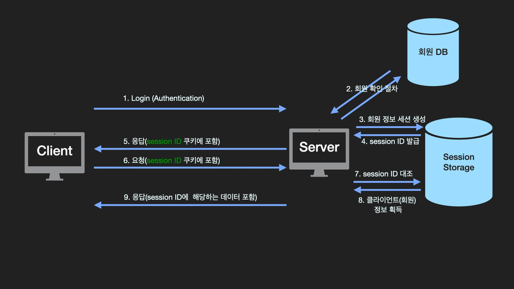

### 암호화 기술

| 기술                            | 설명                                                                                                                                                                                       |
| ------------------------------- | ------------------------------------------------------------------------------------------------------------------------------------------------------------------------------------------ |
| 대칭키 암호화                   | 암호화와 복호화에 동일한 키를 사용하는 암호화 방식. 상대적으로 빠르지만, 키의 노출 위험 존재.                                                                                              |
| 비대칭키 암호화 (공개키 암호화) | 공개키와 개인키 두 가지 키를 사용하여 데이터를 암호화하고 복호화. 공개키는 누구에게나 공개되어 있으며, 데이터를 암호화할 때 사용됨. 개인키는 비밀로 유지되며, 데이터를 복호화할 때 사용됨. |
| 단방향 암호화 (해시 알고리즘)   | 복호화가 불가능한 암호화 방식으로, 주로 민감 정보를 데이터베이스에 저장할 때 사용. 해시 충돌이 발생하지 않도록 주의가 필요.                                                                |

### 웹 보안 아키텍처

#### 보안 계층 구조
```
Client ↔ [방화벽/IPS] ↔ [SSL/TLS] ↔ [WAF] ↔ Web Server ↔ WAS ↔ DB
```

#### 주요 보안 위협과 대응
| 공격 유형 | 설명 | 대응 방법 |
|-----------|------|-----------|
| **SQL 인젝션** | 사용자 입력에 SQL 구문 삽입 | WAF 차단, Prepared Statement |
| **XSS** | 입력에 JavaScript 코드 삽입 | 입력값 검증, CSP 적용 |

#### 보안 솔루션
- **WAF**: 웹 애플리케이션 계층 공격 차단
- **IPS**: 침입 차단 시스템
- **SSL/TLS**: 데이터 암호화

---

### 인증 방식

| 기술                  | 설명                                                                                                                                                                                                                                    |
| --------------------- | --------------------------------------------------------------------------------------------------------------------------------------------------------------------------------------------------------------------------------------- |
| JWT (JSON Web Tokens) | 로그인 시 토큰 인증 방식으로 사용되며, 헤더, 페이로드, 시그니처로 구성. 서버나 세션에 인증 정보를 유지하지 않고, 클라이언트 측에서 들어오는 요청만으로 작업을 처리.                                                                     |
| 세션 인증 방식        | 사용자의 로그인 정보를 서버의 메모리나 데이터베이스에 저장하는 전통적인 인증 방식. 사용자가 로그인하면, 서버는 해당 사용자의 세션을 생성하고, 세션 ID를 클라이언트에게 전달. 클라이언트는 이후의 요청에서 세션 ID를 이용해 인증을 유지. |
| OAuth                 | 제3자 인증 방식으로, 사용자가 소셜 미디어 계정을 사용하여 다른 서비스에 로그인할 수 있게 한다. 사용자는 신뢰할 수 있는 서버에게 정보를 맡기고, 그 서버는 사용자에게 해당 정보에 접근할 수 있는 권한을 부여.                             |
| Access/Refresh 토큰   | Refresh 토큰(수명 더 길다)은 Access 토큰이 만료된 경우 다시 access 토큰을 발급받기 위해 사용. 해커의 탈취 위험 감소                                                                                                                     |

#### 세션 인증 방식

> HTTP는 비연결성, 비상태성의 특성을 갖기 때문에 서버는 클라이언트가 로그인을 했더라도, 이후 요청 때 클라이언트가 로그인을 했었는지 알 수 없음. 이에 쿠키와 세션을 사용해서 로그인
> 

- 사용자가 로그인을 하면 서버는 SessionID를 쿠키에 담아 클라이언트에게 보냄. 클라이언트는 sessionID를 요청 시마다 헤더에 담아서 보내면 서버는 sessionID에 해당하는 클라이언트 정보를 세션 저장소에서 가져와 클라이언트 맞춤 응답 수행.

### JWT 토큰의 구성

| 구성 요소 | 설명                                                                                                              |
| --------- | ----------------------------------------------------------------------------------------------------------------- |
| 헤더      | 토큰의 타입(ex JWT), 암호화 알고리즘                                                                              |
| 페이로드  | 토큰의 정보, 예를 들면 사용자 ID, 유효 기간 등                                                                    |
| 시그니처  | 인코딩된 헤더와 페이로드, 그리고 비밀키를 합쳐 헤더의 알고리즘으로 암호화한 값. 이는 토큰의 무결성과 인증을 보장. |
