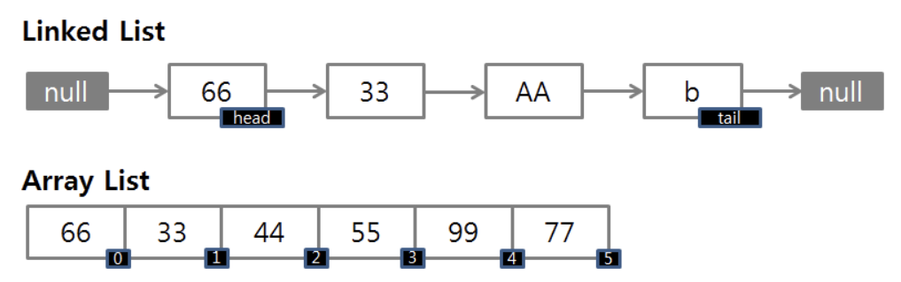

# 자료구조

### 스택, 큐, 트리, 힙

| 자료구조 명 | 설명                                                                                                                                                                     |
| ----------- | ------------------------------------------------------------------------------------------------------------------------------------------------------------------------ |
| 스택        | 먼저 넣은 데이터가 마지막에 나오는 FILO 구조                                                                                                                             |
| Queue       | 먼저 넣은 데이터가 먼저 나오는 FIFO 구조                                                                                                                                 |
| 트리        | 정점과 간선을 이용해 사이클을 이루지 않도록 구성한 graph의 특수한 형태, 계층 데이터 표현에 적합                                                                          |
| 힙          | 최댓값 또는 최솟값 찾아내는 연산을 쉽게 하기 위해 고안된 구조, 각 노드의 키값이 자식의 키값보다 작지 않거나(최대힙), 그 자식의 키 값보다 크지 않은(최소힙) 완전 이진트리 |

### 우선순위 큐

- 가장 우선순위가 높은 데이터를 먼저 꺼내기 위해 고안된 자료구조. 주로 힙을 사용
- 완전 이진트리를 통해 구현되었기 때문에 우선순위 큐의 시간 복잡도는 O(logN)

### 해시 테이블

- key,value로 데이터를 저장하는 자료구조
- 빠른 데이터 검색이 필요할 때 유용
- key 값에 해시 함수를 적용해 고유한 index를 생성하여, 그 index에 저장된 값을 꺼내오는 구조
- 평균적으로 O(1)의 시간 복잡도를 가지지만, 해시의 index값 충돌이 발생한 경우 충돌된 index 값에 대하여 연결된 데이터들을 조회하여 원하는 값을 가져오기 때문에 O(N)까지 시간 복잡도가 증가

### LinkedList와 ArrayList의 차이

- ArrayList

  - 원하는 데이터에 무작위 접근 가능
  - 리스트의 크기 제한(정해져 있음)
  - 데이터의 추가/삭제를 위해서는 임시 배열을 생성하여 복제하고 있어 시간이 오래 걸린다

- LinkedList
  - 리스트의 크기와 무관하게 데이터 추가 가능
  - 데이터 추가 위해 새로운 노드 생성하여 연결하므로 추가/삭제 연산이 빠르다
  - 무작위 접근 불가. 순차 접근만 가능

